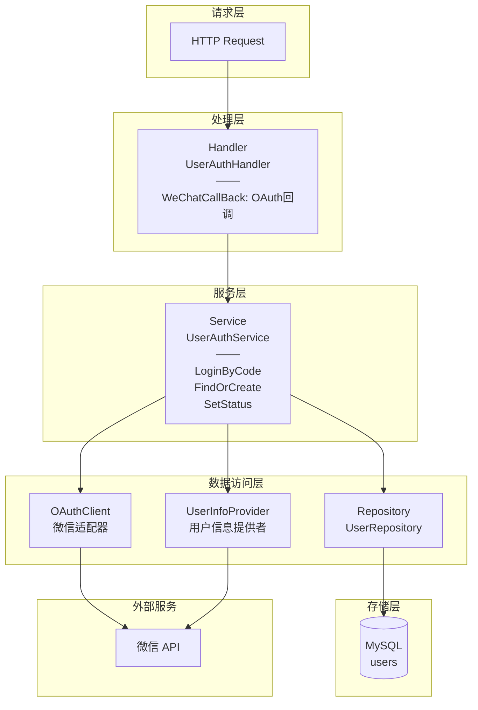
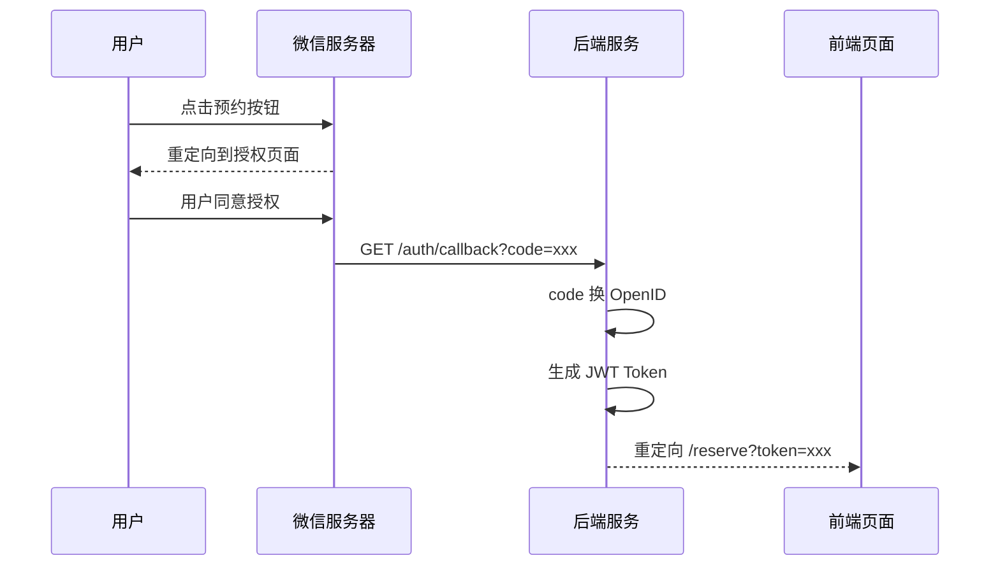
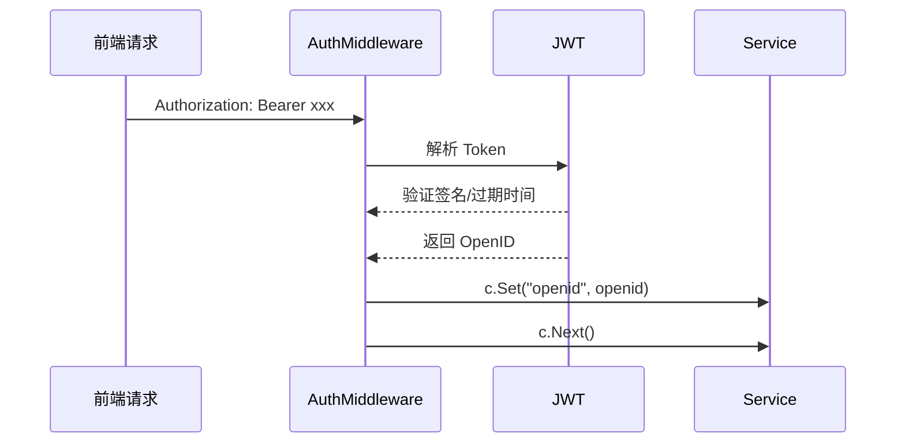

# Auth 模块文档

## 概述

Auth 模块负责用户认证与授权，主要功能包括：
- 微信 OAuth 认证流程
- JWT Token 签发与验证
- 用户信息管理
- 请求鉴权中间件

Auth 模块监听端口 :8080

## 架构设计



## 核心组件

### 1. Model (model.go)

```go
type User struct {
    ID        uint      // 主键
    OpenID    string    // 微信唯一标识（唯一索引）
    Nickname  string    // 昵称
    Status    int       // 状态: 1-正常, 0-已取消关注
    CreatedAt time.Time
    UpdatedAt time.Time
    LastLogin time.Time // 最后登录时间
}
```

**数据库表**: `users`

### 2. Repository (repository.go)

**接口定义**:
```go
type UserRepository interface {
    Upsert(user *User) error           // 存在则更新，不存在则创建
    UpdateStatus(openid string, status int) error
    GetByOpenID(openid string) (*User, error)
}
```

**Upsert 实现**: 使用 GORM 的 `OnConflict` 处理 OpenID 冲突时的自动更新。

### 3. Service (service.go)

**接口定义**:
```go
type OAuthClient interface {
    GetUserAccessToken(code string) (*OAuthAccessTokenResult, error)
    GetUserInfo(openid string) string
}

type UserInfoProvider interface {
    GetUserInfo(openid string) string
}
```

**核心方法**:

| 方法 | 说明 |
|------|------|
| `LoginByCode(code)` | 通过微信授权码换取 OpenID |
| `FindOrCreate(openid)` | 查找用户，不存在则创建 |
| `SetStatus(openid, active)` | 更新用户关注状态 |

### 4. Handler (handler.go)

| 方法 | 路由 | 说明 |
|------|------|------|
| `WeChatCallBack` | `GET /api/v1/auth/callback` | 处理微信 OAuth 回调 |

**处理流程**:
1. 获取微信回调的 `code` 参数
2. 调用 `svc.LoginByCode(code)` 获取 OpenID
3. 调用 `jwt.GenerateToken(openid)` 签发 JWT
4. 重定向到前端页面，URL 携带 token

### 5. Middleware (middleware.go)

**AuthMiddleware**: JWT 验证中间件

**验证流程**:
1. 检查 `Authorization` Header 是否存在
2. 验证格式是否为 `Bearer {token}`
3. 调用 `jwt.ParseToken()` 解析并验证 Token
4. 将 OpenID 注入到 `gin.Context`

**使用方式**:
```go
// 在路由组中使用
authorized := r.Group("/api/v2")
authorized.Use(auth.AuthMiddleware())
{
    authorized.POST("/reservation/submit", handler.SubmitHandler)
}
```

### 6. Wechat Adapter (wechat_adapter.go)

微信 SDK 适配器，封装 `silenceper/wechat` 库:

- `wechatOAuthClient`: 实现 `OAuthClient` 接口
- `wechatUserInfoProvider`: 实现 `UserInfoProvider` 接口

## 认证流程

### 微信 OAuth 授权流程



### API 请求鉴权流程



## 模块初始化

```go
// 在应用启动时调用
func InitModule(db *gorm.DB, oa *officialaccount.OfficialAccount) {
    repo := NewUserRepository(db)
    oauth := NewWechatOAuthClient(oa)
    provider := NewWechatUserInfoProvider(oa)
    instance = NewUserAuthServiceWithUserInfo(repo, oauth, provider)
}

// 获取服务实例
func GetUserAuthService() *UserAuthService
```

## 测试

模块提供了 Mock 实现，支持单元测试：

- `mock_repository.go`: Mock `UserRepository`
- `mock_service.go`: Mock `UserAuthService`

**生成 Mock**:
```bash
go generate ./internal/auth/...
```

**测试示例**:
```go
func TestLoginByCode(t *testing.T) {
    ctrl := gomock.NewController(t)
    defer ctrl.Finish()

    mockOAuth := NewMockOAuthClient(ctrl)
    mockOAuth.EXPECT().
        GetUserAccessToken("test_code").
        Return(&OAuthAccessTokenResult{OpenID: "test_openid"}, nil)

    service := NewUserAuthService(nil, mockOAuth)
    openid, err := service.LoginByCode("test_code")

    assert.NoError(t, err)
    assert.Equal(t, "test_openid", openid)
}
```

## 配置依赖

Auth 模块依赖以下配置：

| 配置项 | 来源 | 说明 |
|--------|------|------|
| 微信 AppID/Secret | config_v1.yaml | 微信公众号配置 |
| JWT Secret | internal/pkg/jwt | Token 签名密钥 |
| MySQL | platform/db.go | 用户数据存储 |

## 注意事项

1. **OpenID 唯一性**: 数据库层面通过 `uniqueIndex` 保证
2. **Token 过期**: JWT Token 有过期时间，前端需要处理过期重新授权
3. **用户状态**: `Status` 字段用于标记用户是否关注公众号
4. **依赖注入**: 通过接口抽象，便于测试和替换实现
