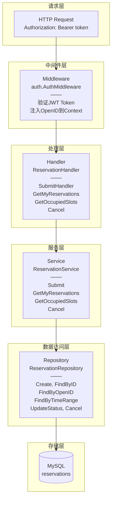
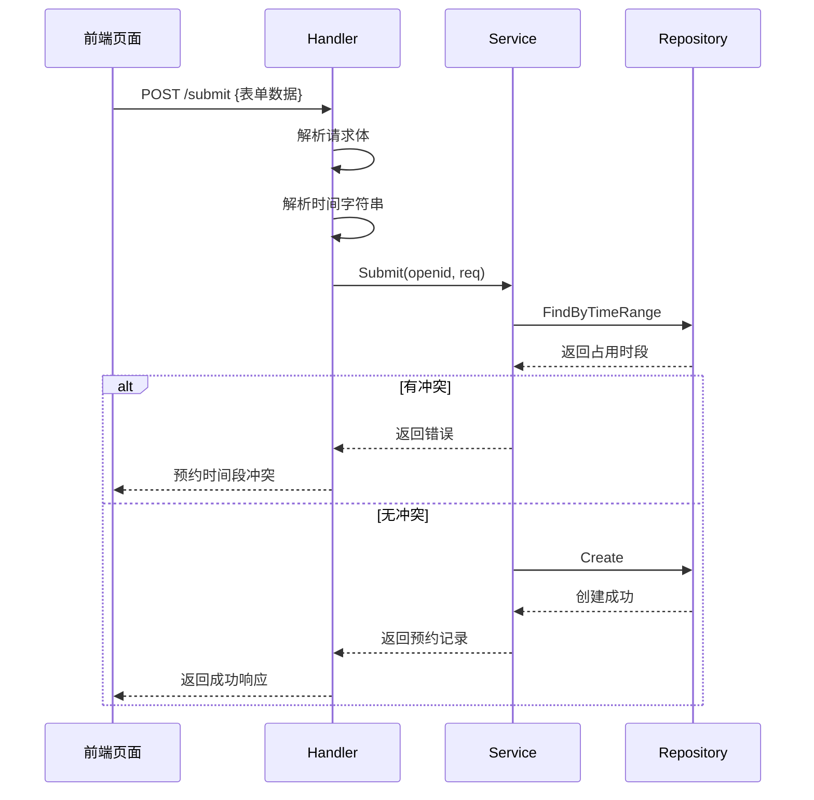
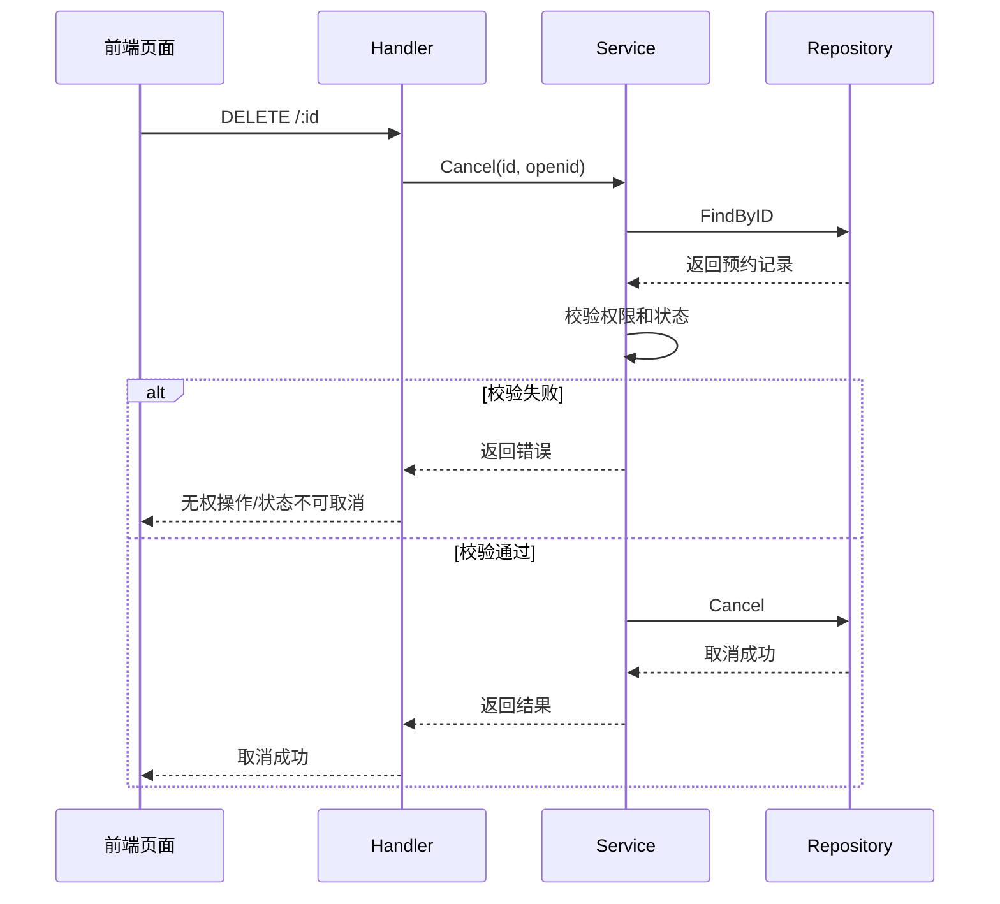

# Reservation 模块文档

## 概述

Reservation 模块负责场地预约业务，主要功能包括：
- 预约申请提交
- 预约时间段冲突检测
- 用户预约列表查询
- 预约取消

## 架构设计



## 核心组件

### 1. Model (model.go)

```go
type Reservation struct {
    ID              uint      // 主键
    OrderNo         string    // 订单号（唯一索引）
    OpenID          string    // 预约人标识（索引）
    ApplicationName string    // 申请人姓名
    Reason          string    // 预约理由
    Phone           string    // 手机号码
    Num             int       // 预约人数
    StartTime       time.Time // 开始时间
    EndTime         time.Time // 结束时间
    Status          int       // 预约状态
    Password        string    // 门锁动态密码
    CreatedAt       time.Time
    UpdatedAt       time.Time
}
```

**预约状态常量**:

| 常量 | 值 | 说明 |
|------|---|------|
| `StatusPending` | 0 | 待审核 |
| `StatusApproved` | 1 | 已通过 |
| `StatusRejected` | 2 | 已拒绝 |
| `StatusCompleted` | 3 | 已完成 |
| `StatusCancelled` | 4 | 已取消 |

**数据库表**: `reservations`

### 2. DTO (dto.go)

**请求对象**:
```go
type SubmitReq struct {
    ApplicantName     string `json:"applicant_name" binding:"required"`
    AlumniAssociation string `json:"alumni_association" binding:"required"`
    Reason            string `json:"reason" binding:"required,max=500"`
    Phone             string `json:"phone" binding:"required,len=11"`
    StartTime         string `json:"start_time" binding:"required"`
    EndTime           string `json:"end_time" binding:"required"`
}
```

**响应对象**:
```go
type ReservationResp struct {
    ID              uint   `json:"id"`
    OrderNo         string `json:"order_no"`
    ApplicationName string `json:"applicant_name"`
    Reason          string `json:"reason"`
    Phone           string `json:"phone"`
    StartTime       string `json:"start_time"`
    EndTime         string `json:"end_time"`
    Status          int    `json:"status"`
    StatusText      string `json:"status_text"`
    CreatedAt       string `json:"created_at"`
}
```

### 3. Repository (repository.go)

**接口定义**:
```go
type ReservationRepository interface {
    Create(res *Reservation) error
    FindByID(id uint) (*Reservation, error)
    FindByOpenID(openid string) ([]*Reservation, error)
    FindByTimeRange(start, end time.Time) ([]*Reservation, error)
    UpdateStatus(id uint, status int) error
    Cancel(id uint, openid string) error
}
```

**核心方法说明**:

| 方法 | 说明 |
|------|------|
| `Create` | 创建预约记录 |
| `FindByID` | 根据 ID 查询预约 |
| `FindByOpenID` | 根据用户 OpenID 查询预约列表 |
| `FindByTimeRange` | 查询指定时间范围内的预约（用于冲突检测） |
| `UpdateStatus` | 更新预约状态 |
| `Cancel` | 取消预约（带权限校验） |

**时间段冲突检测逻辑**:
```go
// 查询与指定时间段有交集的预约
WHERE status IN (0, 1)        -- 仅考虑待审核和已通过的预约
  AND start_time < ?          -- 传入的结束时间
  AND end_time > ?            -- 传入的开始时间
```

### 4. Service (service.go)

**核心方法**:

| 方法 | 说明 |
|------|------|
| `Submit(openid, req)` | 提交预约申请，包含冲突检测 |
| `GetMyReservations(openid)` | 获取用户预约列表 |
| `GetOccupiedSlots(date)` | 获取指定日期已占用时段 |
| `Cancel(id, openid)` | 取消预约 |

**Submit 方法流程**:
1. 解析时间字符串
2. 校验结束时间晚于开始时间
3. 检查时间段是否已被占用
4. 生成订单号
5. 创建预约记录

**订单号生成规则**:
```
R + 时间戳(14位) + 随机数(4位)
示例: R202603301430001234
```

### 5. Handler (handler.go)

**API 接口**:

| 方法 | 路由 | 说明 |
|------|------|------|
| `SubmitHandler` | `POST /api/v2/reservation/submit` | 提交预约 |
| `GetMyReservations` | `GET /api/v2/reservation/my` | 我的预约列表 |
| `GetOccupiedSlots` | `GET /api/v2/reservation/occupied` | 已占用时间段 |
| `Cancel` | `DELETE /api/v2/reservation/:id` | 取消预约 |

## 业务流程

### 预约提交流程



### 预约取消流程



## 模块初始化

```go
// 在应用启动时调用
func InitModule(db *gorm.DB) {
    // 自动迁移表结构
    db.AutoMigrate(&Reservation{})

    // 初始化 Repository
    repo := NewReservationRepository(db)

    // 初始化 Service
    reservationService = NewReservationService(repo)
}

// 获取服务实例
func GetReservationService() *ReservationService
```

## 测试

模块提供了 Mock 实现支持单元测试：

- `mock_repository.go`: Mock `ReservationRepository`

**生成 Mock**:
```bash
go generate ./internal/reservation/...
```

**测试示例**:
```go
func TestSubmit(t *testing.T) {
    ctrl := gomock.NewController(t)
    defer ctrl.Finish()

    mockRepo := NewMockReservationRepository(ctrl)
    mockRepo.EXPECT().
        FindByTimeRange(gomock.Any(), gomock.Any()).
        Return([]*Reservation{}, nil)
    mockRepo.EXPECT().
        Create(gomock.Any()).
        Return(nil)

    service := NewReservationService(mockRepo)
    req := &SubmitReq{
        ApplicantName: "张三",
        Reason:        "测试",
        Phone:         "13800138000",
        StartTime:     "2026-04-05 10:00:00",
        EndTime:       "2026-04-05 12:00:00",
    }

    res, err := service.Submit("test_openid", req)
    assert.NoError(t, err)
    assert.NotNil(t, res)
}
```

## 与 Auth 模块的协作

Reservation 模块依赖 Auth 模块提供的鉴权能力：

1. **路由注册时**：应用 `auth.AuthMiddleware()` 中间件
2. **Handler 中**：从 `gin.Context` 获取 `openid`

```go
// 获取当前用户的 openid
openid, exists := c.Get("openid")
if !exists {
    c.JSON(http.StatusUnauthorized, gin.H{
        "code": 401,
        "msg":  "未授权",
    })
    return
}
```

## 配置依赖

Reservation 模块依赖以下配置：

| 配置项 | 来源 | 说明 |
|--------|------|------|
| MySQL | platform/db.go | 预约数据存储 |
| JWT | auth 模块 | 用户身份验证 |

## 数据库索引建议

为提升查询性能，建议创建以下索引：

```sql
-- 订单号唯一索引（已在 Model 中定义）
CREATE UNIQUE INDEX idx_order_no ON reservations(order_no);

-- 用户标识索引（已在 Model 中定义）
CREATE INDEX idx_open_id ON reservations(open_id);

-- 时间范围查询索引（建议添加）
CREATE INDEX idx_time_range ON reservations(start_time, end_time);

-- 状态索引（建议添加）
CREATE INDEX idx_status ON reservations(status);
```

## 注意事项

1. **时间段冲突检测**：仅检查 `StatusPending` 和 `StatusApproved` 状态的预约
2. **取消限制**：仅允许取消 `StatusPending` 或 `StatusApproved` 状态的预约
3. **权限校验**：取消操作时校验预约是否属于当前用户
4. **订单号唯一性**：数据库层面通过 `uniqueIndex` 保证
5. **时间解析**：使用 `time.ParseInLocation` 确保时区正确
