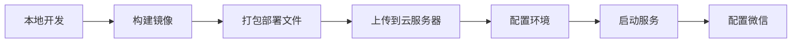

# 云服务器部署指南

## 部署流程概览



## 方式一：使用部署脚本（推荐）

### 1. 本地打包

```bash
# 运行部署脚本
chmod +x deploy.sh
./deploy.sh

# 生成的文件：reservation-sys-deploy.tar.gz
```

### 2. 上传到云服务器

```bash
# 使用 scp 上传
scp reservation-sys-deploy.tar.gz user@your-server-ip:/root/

# 或使用 rsync
rsync -avz reservation-sys-deploy.tar.gz user@your-server-ip:/root/
```

### 3. 云服务器部署

```bash
# SSH 登录到云服务器
ssh user@your-server-ip

# 解压部署包
cd /root
tar -xzf reservation-sys-deploy.tar.gz

# 导入 Docker 镜像
docker load -i reservation-sys.tar

# 配置环境变量
cp .env.example .env
vim .env
```

### 4. 修改配置

```bash
# 修改微信前端 URL（重要！）
vim configs/config_v1.yaml
# 将 frontend_url 改为你的域名
# 例如：https://your-domain.com/reserve

# 修改数据库密码（推荐）
vim .env
```

### 5. 启动服务

```bash
# 启动所有服务
docker-compose -f docker-compose.prod.yaml up -d

# 查看服务状态
docker-compose -f docker-compose.prod.yaml ps

# 查看日志
docker-compose -f docker-compose.prod.yaml logs -f
```

---

## 方式二：使用 Docker Registry

### 1. 推送到 Docker Hub

```bash
# 登录 Docker Hub
docker login

# 标记镜像
docker tag reservation-sys:latest your-username/reservation-sys:latest

# 推送镜像
docker push your-username/reservation-sys:latest
```

### 2. 云服务器拉取

```bash
# 在云服务器上
docker pull your-username/reservation-sys:latest

# 标记为本地镜像
docker tag your-username/reservation-sys:latest reservation-sys:latest
```

---

## 方式三：使用私有镜像仓库

### 使用阿里云容器镜像服务

```bash
# 登录阿里云镜像仓库
docker login --username=your-username registry.cn-hangzhou.aliyuncs.com

# 标记镜像
docker tag reservation-sys:latest registry.cn-hangzhou.aliyuncs.com/your-namespace/reservation-sys:latest

# 推送
docker push registry.cn-hangzhou.aliyuncs.com/your-namespace/reservation-sys:latest
```

---

## 云服务器环境准备

### 1. 安装 Docker

```bash
# Ubuntu/Debian
curl -fsSL https://get.docker.com | bash

# 启动 Docker
systemctl start docker
systemctl enable docker
```

### 2. 安装 Docker Compose

```bash
# 下载 Docker Compose
sudo curl -L "https://github.com/docker/compose/releases/latest/download/docker-compose-$(uname -s)-$(uname -m)" -o /usr/local/bin/docker-compose

# 添加执行权限
sudo chmod +x /usr/local/bin/docker-compose

# 验证安装
docker-compose --version
```

### 3. 开放端口

```bash
# 开放 HTTP 和 HTTPS 端口
# Ubuntu (ufw)
sudo ufw allow 80
sudo ufw allow 443

# CentOS (firewalld)
sudo firewall-cmd --permanent --add-port=80/tcp
sudo firewall-cmd --permanent --add-port=443/tcp
sudo firewall-cmd --reload
```

---

## 配置域名和 SSL（推荐）

### 1. 域名解析

在域名服务商处添加 A 记录：
- 主机记录：`@` 或 `www`
- 记录值：云服务器公网 IP

### 2. 申请 SSL 证书

```bash
# 使用 certbot 申请免费证书
sudo apt install certbot
sudo certbot certonly --standalone -d your-domain.com

# 证书位置
# /etc/letsencrypt/live/your-domain.com/fullchain.pem
# /etc/letsencrypt/live/your-domain.com/privkey.pem
```

### 3. 配置 Nginx SSL

创建 `deploy/ssl` 目录并复制证书：

```bash
mkdir -p deploy/ssl
cp /etc/letsencrypt/live/your-domain.com/fullchain.pem deploy/ssl/
cp /etc/letsencrypt/live/your-domain.com/privkey.pem deploy/ssl/
```

修改 `deploy/nginx/nginx.config` 添加 HTTPS 配置（需要手动配置）。

---

## 微信公众平台配置

### 1. 配置服务器 URL

登录 [微信公众平台](https://mp.weixin.qq.com/)：

**设置 → 开发设置 → 服务器配置**
- URL: `https://your-domain.com/wx`
- Token: `mytesttoken123`（与配置文件一致）

### 2. 配置网页授权域名

**设置 → 公众号设置 → 功能设置 → 网页授权域名**
- 添加: `your-domain.com`（不带 https://）

---

## 服务管理命令

```bash
# 查看服务状态
docker-compose -f docker-compose.prod.yaml ps

# 查看日志
docker-compose -f docker-compose.prod.yaml logs -f

# 重启服务
docker-compose -f docker-compose.prod.yaml restart

# 停止服务
docker-compose -f docker-compose.prod.yaml down

# 更新服务
docker-compose -f docker-compose.prod.yaml pull
docker-compose -f docker-compose.prod.yaml up -d

# 备份数据库
docker exec reservation-mysql mysqldump -u res_user -p${MYSQL_PASSWORD} home_xy > backup.sql

# 查看资源使用
docker stats
```

---

## 常见问题

### 1. 容器无法启动

```bash
# 查看详细日志
docker-compose -f docker-compose.prod.yaml logs v1-service

# 检查配置文件
docker exec reservation-v1 cat /app/configs/config_v1.yaml
```

### 2. 数据库连接失败

```bash
# 检查 MySQL 是否就绪
docker exec reservation-mysql mysql -u res_user -p -e "SELECT 1"

# 查看网络
docker network ls
docker network inspect reservation_sys_go_reservation-net
```

### 3. 微信验证失败

- 检查 Token 是否一致
- 检查 URL 是否可访问
- 查看 v1 服务日志

---

## 性能优化建议

1. **MySQL 配置优化**：修改 `my.cnf` 增加缓冲池大小
2. **Redis 持久化**：配置 RDB 或 AOF 持久化
3. **Nginx 优化**：启用 gzip、配置缓存
4. **日志轮转**：配置 logrotate 防止日志文件过大

---

## 安全建议

1. 修改默认数据库密码
2. 使用环境变量管理敏感信息
3. 定期更新 Docker 镜像
4. 配置防火墙规则
5. 启用 HTTPS
6. 定期备份数据库
