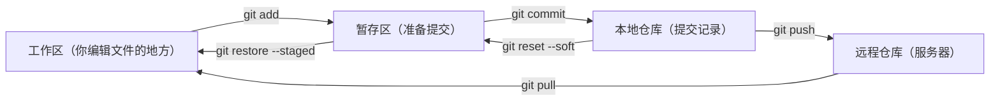

# Git 基础教程

本文档面向从未使用过 Git 的同学，帮助你从零掌握 Git 的基本操作，足以应对日常开发。

---

## 一、Git 是什么

Git 是一个**版本控制工具**，它能帮你：

- **记录每次修改**：随时回退到任意历史版本
- **多人协作**：每个人独立开发，最后合并到一起，不会互相覆盖
- **分支开发**：新功能在独立分支上开发，不影响主分支

---

## 二、核心概念

在敲命令之前，先理解 Git 的四个"区域"和文件的生命周期：



| 概念 | 说明 |
|------|------|
| **工作区** | 你实际编辑文件的地方，就是项目目录 |
| **暂存区** | `git add` 之后文件进入暂存区，表示"准备提交" |
| **本地仓库** | `git commit` 之后文件进入本地仓库，形成一条提交记录 |
| **远程仓库** | 服务器上的仓库（如本项目的 `server`），`git push` 才会同步上去 |

> **关键理解**：`git add` ≠ 保存，`git commit` ≠ 上传。修改文件后，必须经过 add → commit → push 三步，别人才能看到你的代码。

---

## 三、安装与配置

### 1. 首次使用必须配置

```sh
# 设置用户名和邮箱（会出现在每次提交记录中）
git config --global user.name "你的名字"
git config --global user.email "你的邮箱"

# 查看当前配置
git config --list
```

---

## 四、获取项目代码

### 克隆远程仓库

```sh
# git clone <远程地址> [本地目录名]
git clone ssh://root@106.52.23.213/root/git/reservation_sys_go.git

# 克隆到指定目录
git clone ssh://root@106.52.23.213/root/git/reservation_sys_go.git my-project
```

---

## 五、日常操作：修改 → 提交 → 推送

这是你每天用得最多的流程。

### 1. 查看当前状态

```sh
# 查看哪些文件被修改了、哪些已暂存
git status

# 输出示例：
# Changes not staged for commit:     ← 修改了但没 add
#   modified:   service/admin/auth/service.go
#
# Untracked files:                    ← 新文件，Git 还没跟踪
#   doc/学习/git.md
```

### 2. 添加到暂存区

```sh
# 添加单个文件
git add service/admin/auth/service.go

# 添加所有修改的文件
git add .

# 添加某个目录下所有修改
git add service/admin/
```

### 3. 提交到本地仓库

```sh
# 提交暂存区的内容，-m 后面是提交说明
git commit -m "修复管理员登录接口的空上下文问题"

# 提交说明要简洁明了，说清楚做了什么
```

### 4. 推送到远程仓库

```sh
# 推送到远程仓库的当前分支
git push server workspace

# 首次推送新分支时，设置上游关联（以后只需 git push 即可）
git push -u server workspace
```

### 5. 完整流程示例

```sh
# 1. 修改了代码后，查看改了什么
git status

# 2. 确认无误，添加到暂存区
git add .

# 3. 提交到本地
git commit -m "添加预约取消功能"

# 4. 推送到远程
git push server workspace
```

---

## 六、查看与对比

### 1. 查看提交历史

```sh
# 查看完整提交历史
git log

# 简洁模式（一行一条）
git log --oneline

# 只看最近 5 条
git log --oneline -5

# 查看某个文件的修改历史
git log --oneline service/admin/auth/service.go
```

### 2. 查看代码差异

```sh
# 查看工作区和暂存区的差异（修改了什么还没 add）
git diff

# 查看暂存区和上次提交的差异（add 了但还没 commit）
git diff --staged

# 查看某个文件的修改
git diff service/admin/auth/service.go
```

---

## 七、撤销操作

### 1. 撤销工作区修改（还没 add）

```sh
# 撤销单个文件的修改，恢复到上次提交的状态
git restore service/admin/auth/service.go

# 撤销所有修改（谨慎使用！）
git restore .
```

> **注意**：`git restore` 会丢弃你还没 add 的修改，无法恢复。

### 2. 撤销暂存（add 了但还没 commit）

```sh
# 把文件从暂存区移回工作区（不会丢失修改内容）
git restore --staged service/admin/auth/service.go

# 移回所有暂存文件
git restore --staged .
```

### 3. 修改最后一次提交

```sh
# 提交后发现漏了文件或写错了提交信息
git add <遗漏的文件>
git commit --amend -m "正确的提交信息"

# 注意：如果已经 push 过，不要用 amend，会导致历史冲突
```

---

## 八、分支操作

分支是 Git 最强大的功能。你可以在独立分支上开发新功能，完成后再合并回主分支。

### 1. 查看分支

```sh
# 查看本地分支
git branch

# 查看所有分支（本地 + 远程）
git branch -a

# 查看远程分支
git branch -r
```

### 2. 创建与切换分支

```sh
# 创建新分支（基于当前分支）
git switch -c workspace

# 切换到已有分支
git switch master

# 创建并切换到远程分支的本地副本
git switch -c feature server/feature
```

### 3. 删除分支

```sh
# 删除本地分支（必须先切换到其他分支）
git switch master
git branch -d workspace

# 删除远程分支
git push server --delete workspace
```

### 4. 重命名分支

```sh
# 重命名当前分支
git branch -M main
```

---

## 九、分支合并

把一个分支的修改合并到另一个分支：

```sh
# 场景：把 workspace 分支的修改合并到 master

# 1. 先在 workspace 分支提交代码
git switch workspace
git add .
git commit -m "完成预约功能开发"

# 2. 切换到 master 分支
git switch master

# 3. 先拉取远程最新代码（避免冲突）
git pull server master

# 4. 合并 workspace 到当前分支（master）
git merge workspace

# 5. 推送到远程
git push server master
```

### 处理合并冲突

如果两个分支修改了同一行代码，合并时会产生冲突：

```sh
# Git 会提示哪些文件冲突了
# CONFLICT (content): Merge conflict in service/admin/auth/service.go

# 1. 打开冲突文件，会看到类似标记：
# <<<<<<< HEAD
# 当前分支的代码
# =======
# 被合并分支的代码
# >>>>>>> workspace

# 2. 手动编辑，保留正确的代码，删除 <<<<<<< / ======= / >>>>>>> 标记

# 3. 标记冲突已解决
git add service/admin/auth/service.go

# 4. 完成合并提交
git commit -m "合并 workspace 分支，解决冲突"
```

---

## 十、远程仓库管理

### 1. 查看与添加远程仓库

```sh
# 查看所有远程仓库
git remote -v

# 添加远程仓库
git remote add server ssh://root@106.52.23.213/root/git/reservation_sys_go.git

# 修改远程仓库地址
git remote set-url server ssh://root@106.52.23.213/root/git/reservation_sys_go.git

# 删除远程仓库
git remote remove server
```

### 2. 拉取远程代码

```sh
# 拉取并合并远程分支的代码（常用）
git pull server master

# 仅下载远程信息但不合并（用于查看远程是否有更新）
git fetch server
```

### 3. 推送代码

```sh
# 推送当前分支到远程
git push server workspace

# 首次推送新分支，设置上游关联
git push -u server workspace
```

---

## 十一、一次完整操作的命令序列

```sh
# 开始开发
git switch workspace

# 编写代码...

# 查看修改了什么
git status
git diff

# 提交
git add .
git commit -m "添加审核通知功能"

# 合并到主分支并推送
git switch master
git pull server master
git merge workspace
git push server master

# 回到开发分支继续工作
git switch workspace
```

---

## 十二、实用技巧

### 1. 不想提交某些文件？用 .gitignore

在项目根目录创建 `.gitignore` 文件：

```gitignore
# 编译产物
bin/
*.exe

# 依赖目录
vendor/

# IDE 配置
.idea/
.vscode/

# 环境配置（包含敏感信息）
.env
*.local.yaml

# 系统文件
.DS_Store
Thumbs.db
```

### 2. 临时保存工作（stash）

当你正在开发，突然需要切换分支修 bug：

```sh
# 保存当前未提交的修改
git stash

# 切换到其他分支修 bug
git switch master
# ... 修复 bug 并提交 ...

# 回到开发分支，恢复之前的工作
git switch workspace
git stash pop
```

### 3. 查看某行代码是谁写的

```sh
# 查看文件每一行最后是谁修改的
git blame service/admin/auth/service.go

# 只看某几行
git blame -L 10,20 service/admin/auth/service.go
```

### 4. 回退到历史版本

```sh
# 查看历史提交，找到要回退的版本号
git log --oneline

# 回退到指定版本（保留工作区修改）
git reset --soft abc1234

# 回退到指定版本（丢弃所有修改，慎用！）
git reset --hard abc1234
```

---

## 十三、常见问题

### 1. 推送被拒绝（remote rejected）

```sh
# 原因：远程有新的提交，你本地不是最新的
# 解决：先拉取再推送
git pull server master
git push server master
```

### 2. 合并冲突不知道怎么处理

```sh
# 如果合并后想放弃，回到合并前的状态
git merge --abort

# 查看哪些文件有冲突
git status    # 找到 "both modified" 的文件
```

### 3. commit 了但想修改提交信息

```sh
# 修改最后一次提交的信息
git commit --amend -m "新的提交信息"
```

### 4. 误删了分支

```sh
# 查看操作记录，找到被删分支的 commit 号
git reflog

# 基于那个 commit 重建分支
git switch -c workspace abc1234
```

---

## 十四、命令速查表

| 操作 | 命令 |
|------|------|
| **获取代码** | |
| 克隆仓库 | `git clone <地址>` |
| **日常三步** | |
| 查看状态 | `git status` |
| 添加到暂存区 | `git add .` |
| 提交 | `git commit -m "说明"` |
| 推送 | `git push server workspace` |
| **查看** | |
| 查看修改内容 | `git diff` |
| 查看提交历史 | `git log --oneline` |
| **撤销** | |
| 撤销工作区修改 | `git restore <文件>` |
| 撤销暂存 | `git restore --staged <文件>` |
| **分支** | |
| 创建并切换分支 | `git switch -c <分支名>` |
| 切换分支 | `git switch <分支名>` |
| 查看分支 | `git branch -a` |
| 合并分支 | `git merge <分支名>` |
| 删除分支 | `git branch -d <分支名>` |
| **远程** | |
| 查看远程仓库 | `git remote -v` |
| 拉取代码 | `git pull server master` |
| 添加远程仓库 | `git remote add <名> <地址>` |
