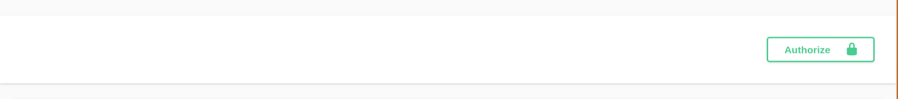

# 为什么需要有 API 文档，swagger有什么优势
## 1. API 文档

API 文档的作用: 定义好请求的内容、格式以及响应的内容、格式，方便代码编写，测试以及交流

---

## 2. Swagger 工具
swagger 是一种流行的API文档生成工具，它可以帮助开发者自动生成美观、**交互式**的API文档，提高开发效率和团队协作

---

# swagger 如何生成 API 文档
1. 在 Go 代码中写注释注解 `main.go + handler.go + dto.go`
2. 运行 `swag init` 自动生成文档
```sh
go run github.com/swaggo/swag/cmd/swag@latest init -g cmd/api/v2/main.go -o docs --parseDependency
```
3. 通过 `Swagger UI` 服务读取这些文件，进行交互测试

---

# swagger 如何定义鉴权机制
swagger 注解分为 **全局注解** 与 **接口注解**

swagger 使用 **全局注解** 定义鉴权机制，写在 `main.go` 的 `package` 注释中。

本项目关于鉴权机制的内容定义在文件 `cmd/api/v2/main.go`中
```go
// @securityDefinitions.apikey BearerAuth
// @in              header
// @name            Authorization
// @description     JWT Bearer令牌认证，格式: Bearer token
```
---

网页效果如下:




在value里面填写 `Bearer token`

---

# swagger 如何定义API
swagger 系统API的请求响应，定义在 handler 文件中，响应体定义在 dto 文件中

```go
// SubmitHandler 处理预约提交请求（支持多时间段批量提交）
// @Summary      提交预约申请（支持多时段）
// @Description  用户提交场地预约申请，支持一次提交1~4个时间段，需要JWT认证
// @Tags         预约管理
// @Accept       json
// @Produce      json
// @Param        Authorization  header    string     true  "Bearer JWT令牌"  default(Bearer )
// @Param        body           body      SubmitReq  true  "预约提交请求（含多个时间段）"
// @Success      200            {object}  Response{data=OrderResp} "预约申请提交成功"
// @Failure      400            {object}  Response                        "请求参数错误"
// @Failure      401            {object}  Response                        "未授权"
// @Security     BearerAuth
// @Router       /api/v2/reservation/submit [post]
```

---

# 本系统如何使用 swagger 
## 查看文档
```sh
# 开启 swagger 后端程序，然后去浏览器中查看
go run cmd/api/swagger/main.go
```
---

## 使用 swagger 进行请求测试
```sh
# 生成 JWT 令牌
go run cmd/tool/jwt/gen_token.go

# 运行后端程序
go run cmd/api/v2/main.go --config configs/config_v2.debug.yaml
```
在浏览器UI界面，点击 try it out 然后再点击 execute，就可以查看响应