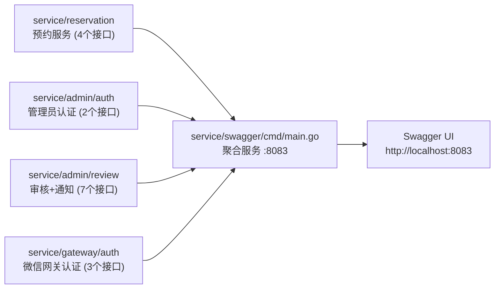
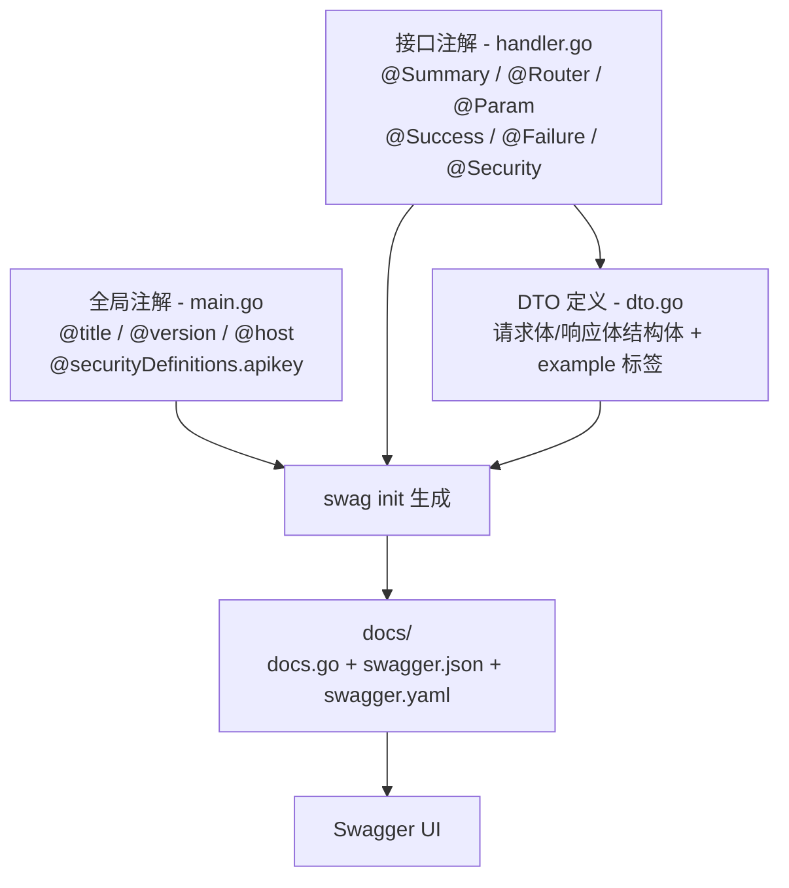
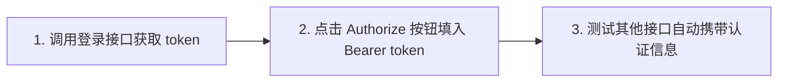

# Swagger API 文档

## 一、为什么需要 API 文档

API 文档的作用：定义好请求的内容、格式以及响应的内容、格式，方便代码编写、测试以及交流。

## 二、Swagger 是什么

Swagger（现称 OpenAPI）是一种流行的 API 文档生成工具，它可以：

- **自动生成**美观、交互式的 API 文档，无需手写
- **在线测试**：直接在网页上发送请求，查看响应
- **代码即文档**：注解写在代码中，修改代码时同步更新文档，不会过时

---

## 三、本项目 Swagger 架构

本项目包含 3 个子服务、13 个接口，通过一个**聚合服务**统一展示所有 API 文档：



**接口分组（Tags）：**

| Tags 分组 | 所属服务 | 接口数 | 说明 |
|-----------|---------|--------|------|
| 预约-用户端 | reservation | 4 | 提交预约、我的预约、已占时段、取消预约 |
| 管理员-认证 | admin/auth | 2 | 登录、获取管理员信息 |
| 管理员-审核 | admin/review | 5 | 订单列表/详情、一级/二级审核、设置密码 |
| 管理员-通知 | admin/review | 2 | 通过通知、驳回通知 |
| 网关-认证 | gateway/auth | 1 | 微信 OAuth 回调 |
| 网关-管理员认证 | gateway/auth | 2 | 管理员登录、获取信息 |

---

## 四、Swagger 注解体系

Swagger 注解分为**全局注解**和**接口注解**两类，分别写在不同的文件中：



---

## 五、全局注解

全局注解定义 API 文档的基本信息和鉴权机制，写在 `service/swagger/cmd/main.go` 的 `package` 注释中：

```go
// @title                        深圳大学校友会会议室预约系统 API
// @version                      1.0
// @description                  包含用户端预约、管理员审核、微信网关认证三个子系统的接口文档
// @host                         localhost:8083
// @BasePath                     /
//
// @securityDefinitions.apikey   BearerAuth
// @in                           header
// @name                         Authorization
// @description                  在请求头中添加 Authorization: Bearer <token>，用户端和管理员端使用不同的 JWT
```

### 全局注解说明

| 注解 | 值 | 说明 |
|------|-----|------|
| `@title` | 深圳大学校友会会议室预约系统 API | 文档标题 |
| `@version` | 1.0 | API 版本号 |
| `@description` | 包含用户端预约... | API 整体描述 |
| `@host` | localhost:8083 | API 服务地址 |
| `@BasePath` | / | API 基础路径 |
| `@securityDefinitions.apikey` | BearerAuth | 定义 API Key 认证方式 |
| `@in` | header | 认证信息位置（请求头） |
| `@name` | Authorization | 请求头字段名 |
| `@description` | 在请求头中添加... | 认证说明 |

> 全局定义了 `BearerAuth` 后，接口注解中只需写 `@Security BearerAuth` 即可关联此鉴权机制。

---

## 六、接口注解

接口注解写在 `handler.go` 中，描述单个 API 的请求和响应。

### 完整注解示例

```go
// SubmitHandler 处理预约提交请求（支持多时间段批量提交）
// @Summary      提交预约申请（支持多时段）
// @Description  用户提交场地预约申请，支持一次提交1~4个时间段，需要JWT认证
// @Tags         预约-用户端
// @Accept       json
// @Produce      json
// @Param        Authorization  header    string     true  "Bearer JWT令牌"  default(Bearer )
// @Param        body           body      SubmitReq  true  "预约提交请求（含多个时间段）"
// @Success      200            {object}  Response{data=OrderResp} "预约申请提交成功"
// @Failure      400            {object}  Response                   "请求参数错误"
// @Failure      401            {object}  Response                   "未授权"
// @Security     BearerAuth
// @Router       /api/v2/reservation/submit [post]
```

### 注解逐行解释

| 注解 | 值 | 说明 |
|------|-----|------|
| `@Summary` | 提交预约申请（支持多时段） | 接口简要描述，显示在接口列表中 |
| `@Description` | 用户提交场地预约申请... | 接口详细描述，展开后可见 |
| `@Tags` | 预约-用户端 | 接口分组，相同 Tags 的接口归到一起 |
| `@Accept` | json | 请求的 Content-Type |
| `@Produce` | json | 响应的 Content-Type |
| `@Param` | Authorization header ... | 请求参数（详见下方） |
| `@Success` | 200 {object} Response{data=OrderResp} | 成功响应 |
| `@Failure` | 400 {object} Response | 错误响应 |
| `@Security` | BearerAuth | 关联全局定义的鉴权机制 |
| `@Router` | /api/v2/reservation/submit [post] | 路由路径和 HTTP 方法 |

### @Param 参数格式

```
@Param <参数名>  <参数位置>  <数据类型>  <是否必填>  <描述>  <默认值>
```

**参数位置（paramType）**：

| 位置 | 说明 | 示例 |
|------|------|------|
| `query` | URL 查询参数 | `@Param date query string true "日期"` |
| `path` | URL 路径参数 | `@Param id path int true "订单ID"` |
| `header` | 请求头 | `@Param Authorization header string true "Bearer JWT令牌"` |
| `body` | 请求体 | `@Param body body SubmitReq true "提交请求"` |

**是否必填**：`true` 必填 / `false` 可选

**默认值**：`default(Bearer )` 表示默认值为 `Bearer `

### @Success / @Failure 响应格式

```
@Success <状态码>  {<类型>}  <结构体>  "<描述>"
```

**类型说明**：

| 写法 | 含义 |
|------|------|
| `{object} Response` | 返回 Response 结构体 |
| `{object} Response{data=OrderResp}` | Response 的 data 字段是 OrderResp |
| `{object} Response{data=[]OrderResp}` | data 是 OrderResp 数组 |
| `{string} string` | 返回纯字符串 |

### @Router 路由格式

```
@Router <路径> [<HTTP方法>]
```

HTTP 方法：`[get]`、`[post]`、`[put]`、`[delete]`、`[patch]`

---

## 七、DTO 结构体与 example 标签

DTO（Data Transfer Object）文件定义请求体和响应体的结构，Swagger 会读取结构体的字段和 `example` 标签来生成文档中的示例值。

### 请求体示例

```go
type SubmitReq struct {
    ApplicantName     string        `json:"applicant_name" example:"张三"`
    AlumniAssociation string        `json:"alumni_association" example:"计算机学院校友会"`
    Year              string        `json:"year" example:"2020"`
    Major             string        `json:"major" example:"计算机科学与技术"`
    Reason            string        `json:"reason" example:"举办技术沙龙"`
    Phone             string        `json:"phone" example:"13800138000"`
    Slots             []TimeSlotReq `json:"slots"`
}
```

> `example` 标签的值会显示在 Swagger UI 的请求示例中，方便测试时快速填写。

### 响应体示例

```go
type Response struct {
    Code int         `json:"code" example:"0"`
    Msg  string      `json:"msg" example:"success"`
    Data interface{} `json:"data"`
}
```

---

## 八、本项目全部接口一览

### 预约-用户端（reservation）

| 方法 | 路径 | 说明 | 需认证 |
|------|------|------|--------|
| POST | `/api/v2/reservation/submit` | 提交预约申请 | ✅ |
| GET | `/api/v2/reservation/my` | 获取我的预约列表 | ✅ |
| GET | `/api/v2/reservation/occupied` | 获取已占用时段 | ❌ |
| DELETE | `/api/v2/reservation/{id}` | 取消预约 | ✅ |

### 管理员-认证（admin/auth）

| 方法 | 路径 | 说明 | 需认证 |
|------|------|------|--------|
| POST | `/api/v3/auth/login` | 管理员登录 | ❌ |
| GET | `/api/v3/admin/info` | 获取当前管理员信息 | ✅ |

### 管理员-审核（admin/review）

| 方法 | 路径 | 说明 | 需认证 |
|------|------|------|--------|
| GET | `/api/v3/orders` | 获取订单列表 | ✅ |
| GET | `/api/v3/orders/{id}` | 获取订单详情 | ✅ |
| POST | `/api/v3/review/level1/{id}` | 一级审核 | ✅ |
| POST | `/api/v3/review/level2/{id}` | 二级审核 | ✅ |
| PUT | `/api/v3/review/level1/{id}/slots/{slotID}/password` | 设置门锁密码 | ✅ |

### 管理员-通知（admin/review）

| 方法 | 路径 | 说明 | 需认证 |
|------|------|------|--------|
| POST | `/api/v3/review/level1/{id}/notify` | 发送审核通过通知 | ✅ |
| POST | `/api/v3/review/level1/{id}/reject-notify` | 发送驳回通知 | ✅ |

### 网关-认证（gateway/auth）

| 方法 | 路径 | 说明 | 需认证 |
|------|------|------|--------|
| GET | `/api/v1/auth/callback` | 微信 OAuth 回调 | ❌ |
| POST | `/api/v1/auth/admin/login` | 管理员登录（Gateway） | ❌ |
| GET | `/api/v1/auth/admin/info` | 获取管理员信息（Gateway） | ✅ |

---

## 九、生成与查看文档

### 1. 生成文档

修改注解后，需要重新运行 `swag init` 生成文档：

```sh
# 在项目根目录执行
swag init -g service/swagger/cmd/main.go -o docs --parseDependency

# 参数说明：
#   -g                 指定包含全局注解的 main.go 入口文件
#   -o docs            输出目录
#   --parseDependency  解析依赖包（用于扫描被 blank import 引入的子服务）
```

生成后会在 `docs/` 目录下产生三个文件：
- `docs.go` — Go 源码，包含 SwaggerInfo 变量
- `swagger.json` — OpenAPI JSON 格式
- `swagger.yaml` — OpenAPI YAML 格式

### 2. 启动 Swagger 文档服务

```sh
# 启动聚合文档服务
go run service/swagger/cmd/main.go
```

启动后访问 http://localhost:8083 即可查看 Swagger UI。

### 3. 查看 API 文档

1. 浏览器打开 http://localhost:8083
2. 页面自动跳转到 http://localhost:8083/swagger/index.html
3. 按 Tags 分组浏览所有接口

---

## 十、使用 Swagger 测试接口

### 1. 不需要认证的接口

如管理员登录：

1. 找到 **管理员-认证** 分组下的 `POST /api/v3/auth/login`
2. 点击展开 → 点击 **Try it out**
3. 在请求体中填写参数
4. 点击 **Execute** 执行请求
5. 查看响应结果

### 2. 需要认证的接口

需要先获取 JWT 令牌，再填入 Authorize：



**具体步骤：**

1. 先调用登录接口获取 token
2. 点击页面右上角 **Authorize** 按钮
3. 在输入框中填入 `Bearer <你的token>`（注意 Bearer 后面有空格）
4. 点击 **Authorize** 确认
5. 之后测试需要认证的接口时，Swagger 会自动在请求头中带上 Authorization

### 3. 注意事项

- **用户端和管理员端的 JWT 不同**：用户端 token 不能用于管理员端接口，反之亦然
- **token 过期**：如果返回 401，需要重新登录获取新 token
- **修改注解后**：需要重新运行 `swag init` 并重启文档服务

---

## 十一、注解速查表

### 全局注解（main.go）

| 注解 | 说明 | 示例 |
|------|------|------|
| `@title` | API 标题 | `@title 预约系统 API` |
| `@version` | API 版本 | `@version 1.0` |
| `@description` | API 描述 | `@description 预约系统接口文档` |
| `@host` | 服务地址 | `@host localhost:8083` |
| `@BasePath` | 基础路径 | `@BasePath /` |
| `@securityDefinitions.apikey` | 定义 API Key 认证 | `@securityDefinitions.apikey BearerAuth` |
| `@in` | 认证信息位置 | `@in header` |
| `@name` | 请求头字段名 | `@name Authorization` |

### 接口注解（handler.go）

| 注解 | 说明 | 示例 |
|------|------|------|
| `@Summary` | 接口简要描述 | `@Summary 提交预约` |
| `@Description` | 接口详细描述 | `@Description 支持多时段` |
| `@Tags` | 接口分组 | `@Tags 预约-用户端` |
| `@Accept` | 请求 Content-Type | `@Accept json` |
| `@Produce` | 响应 Content-Type | `@Produce json` |
| `@Param` | 请求参数 | `@Param id path int true "订单ID"` |
| `@Success` | 成功响应 | `@Success 200 {object} Response` |
| `@Failure` | 错误响应 | `@Failure 400 {object} Response` |
| `@Security` | 关联鉴权 | `@Security BearerAuth` |
| `@Router` | 路由和方法 | `@Router /api/v2/submit [post]` |

### @Param 参数位置

| 位置 | 用途 | 示例 |
|------|------|------|
| `query` | URL 查询参数 | `?page=1&status=5` |
| `path` | URL 路径参数 | `/orders/{id}` |
| `header` | 请求头 | `Authorization: Bearer xxx` |
| `body` | 请求体 | JSON 数据 |
