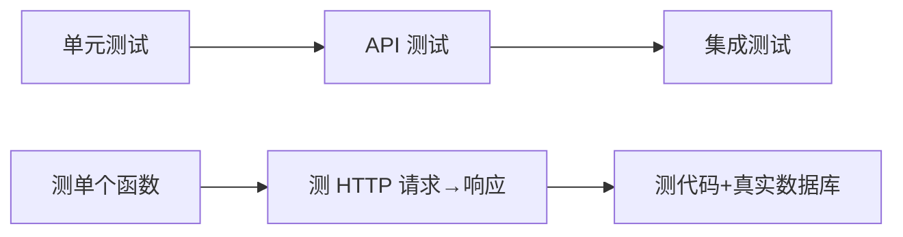

# API 端到端测试

##一、什么是 API 测试

API 测试是从 **HTTP 层面**验证整个请求-响应链路是否正确，包括中间件、路由、参数校验、业务处理、响应格式。

它介于单元测试和集成测试之间：



**本项目的 API 测试特点**：
- 使用 `httptest` 在内存中模拟 HTTP 请求，**不需要启动真实服务器**
- 使用 Mock Repository 替代真实数据库，**测试速度快**
- 组装完整的 Gin 路由和中间件，**验证中间件行为**

---

## 二、核心工具

### httptest — 在内存中发送 HTTP 请求

```go
import "net/http/httptest"

// 1. 创建测试请求
req := httptest.NewRequest("POST", "/api/reservation/reservation/submit", strings.NewReader(jsonBody))
req.Header.Set("Content-Type", "application/json")
req.Header.Set("Authorization", "Bearer "+token)

// 2. 创建响应记录器
w := httptest.NewRecorder()

// 3. 交给 Gin 路由处理（不经过网络，纯内存调用）
r.ServeHTTP(w, req)

// 4. 验证
assert.Equal(t, 200, w.Code)
```

### 完整 Gin 路由组装

API 测试的关键是**组装完整路由**（包括中间件），这样才能验证中间件行为：

```go
func setupReservationAPI(t *testing.T) (*gomock.Controller, *reservation.MockReservationRepository, *gin.Engine) {
    gin.SetMode(gin.TestMode)
    ctrl := gomock.NewController(t)
    mockRepo := reservation.NewMockReservationRepository(ctrl)
    svc := reservation.NewReservationService(mockRepo)
    hdl := reservation.NewReservationHandler(svc)

    r := gin.New()

    // 需要认证的路由
    api := r.Group("/api/reservation")
    api.Use(middleware.AuthMiddleware())          // ← JWT 中间件
    {
        api.POST("/reservation/submit", hdl.SubmitHandler)
        api.GET("/reservation/my", hdl.GetMyReservations)
        api.DELETE("/reservation/:id", hdl.Cancel)
    }

    // 不需要认证的路由
    r.GET("/api/reservation/reservation/occupied", hdl.GetOccupiedSlots)

    return ctrl, mockRepo, r
}
```

---

## 三、测试文件结构

```
tests/api/
├── reservation_api_test.go    ← 用户端 API 测试
└── admin_api_test.go         ← 管理端 API 测试
```

### TestMain 初始化 JWT

API 测试需要在两个包中分别初始化 JWT（因为 reservation 和 admin 使用不同的 JWT 实例）：

```go
func TestMain(m *testing.M) {
    jwt.InitUserJWT("api-test-secret-key", 24)   // 用户 JWT
    jwt.InitAdminJWT("admin-api-test-secret", 24) // 管理员 JWT
    os.Exit(m.Run())
}
```

---

## 四、用户端 API 测试（reservation）

### 测试覆盖

| 测试函数 | 子测试 | 验证点 |
|---------|--------|--------|
| `TestReservationAPI_Submit` | 完整提交流程返回200 | Mock 数据库成功，验证响应 code=200 |
| | 无Token返回401 | AuthMiddleware 拦截未认证请求 |
| | 空body返回400 | 参数校验拒绝空请求体 |
| | 超4个时段返回400 | 业务规则：最多选4个时段 |
| | 时段冲突返回400 | 冲突检测返回明确错误消息 |
| `TestReservationAPI_GetMyReservations` | 成功返回订单列表 | 按 openid 查询返回正确数据 |
| | 无Token返回401 | 认证拦截 |
| `TestReservationAPI_GetOccupiedSlots` | 成功返回已占用时段 | 无需认证，按日期查询 |
| | 日期格式错误返回400 | `?date=invalid` 被参数校验拒绝 |
| `TestReservationAPI_Cancel` | 成功取消 | 返回"取消成功" |
| | 订单不存在返回400 | 错误提示 |
| | 无Token返回401 | 认证拦截 |

### 测试示例：提交预约

```go
func TestReservationAPI_Submit(t *testing.T) {
    ctrl, mockRepo, r := setupReservationAPI(t)
    defer ctrl.Finish()

    token := generateTestToken(t, "test_openid_001")

    t.Run("完整提交流程返回200", func(t *testing.T) {
        body := `{
            "applicant_name":"张三",
            "alumni_association":"计算机与软件学院校友会",
            "year":2020,
            "major":"软件工程",
            "reason":"举办技术讲座",
            "phone":"13800138000",
            "slots":[{"start_time":"2026-06-01 08:00:00","end_time":"2026-06-01 10:00:00"}]
        }`

        // 设置 Mock 期望
        mockRepo.EXPECT().CreateOrderWithLock(gomock.Any(), gomock.Any()).Return(nil)
        mockRepo.EXPECT().FindOrderByID(uint(1)).Return(&reservationdb.ReservationOrder{...}, nil)

        // 发送请求
        req := httptest.NewRequest("POST", "/api/reservation/reservation/submit", strings.NewReader(body))
        req.Header.Set("Content-Type", "application/json")
        req.Header.Set("Authorization", "Bearer "+token)
        w := httptest.NewRecorder()
        r.ServeHTTP(w, req)

        assert.Equal(t, 200, w.Code)
    })
}
```

---

## 五、管理端 API 测试（admin）

### 测试覆盖

| 测试函数 | 子测试 | 验证点 |
|---------|--------|--------|
| `TestAdminAPI_Login` | 登录成功 | gRPC 验证成功，返回 token |
| | 凭证错误 | 错误消息返回 401 |
| `TestAdminAPI_GetAdminInfo` | 成功获取信息 | Token 有效时返回管理员信息 |
| | 无Token返回401 | AdminAuthMiddleware 拦截 |
| `TestAdminAPI_GetOrderList` | 获取全部订单 | 分页参数正确传递 |
| `TestAdminAPI_Level1Review` | 一级审核通过 | 一级管理员权限 + 审核逻辑 |
| | 非一级管理员访问被拒绝 | RoleMiddleware 返回 403 |
| `TestAdminAPI_Level2Review` | 二级审核通过 | 二级管理员权限 + 审核逻辑 |
| | 非二级管理员访问被拒绝 | RoleMiddleware 返回 403 |
| `TestAdminAPI_SetPassword` | 设置密码成功 | 一级管理员为已通过时段设置密码 |

### 路由组装（含角色中间件）

管理员 API 测试的关键是正确组装**双层中间件**（认证 + 角色）：

```go
func setupAdminAPI(t *testing.T) (*gomock.Controller, *MockAccountServiceClient, *MockRepository, *gin.Engine) {
    // ... 创建 Mock ...

    r := gin.New()

    // 认证路由（无需 token）
    authGroup := r.Group("/api/admin/auth")
    authGroup.POST("/login", authHdl.LoginHandler)

    // 需认证路由
    api := r.Group("/api/admin")
    api.Use(adminauth.AdminAuthMiddleware())     // ← 第一层：JWT 认证
    {
        api.GET("/orders", reviewHdl.GetOrderListHandler)

        // 一级管理员路由
        level1 := api.Group("/review")
        level1.Use(adminauth.RoleMiddleware(constants.RoleLevel1))  // ← 第二层：角色
        {
            level1.POST("/level1/:id", reviewHdl.Level1ReviewHandler)
        }

        // 二级管理员路由
        level2 := api.Group("/review")
        level2.Use(adminauth.RoleMiddleware(constants.RoleLevel2))  // ← 第二层：角色
        {
            level2.POST("/level2/:id", reviewHdl.Level2ReviewHandler)
        }
    }

    return ctrl, mockAccount, mockRepo, r
}
```

### 角色权限测试示例

```go
func TestAdminAPI_Level1Review(t *testing.T) {
    _, _, mockRepo, r := setupAdminAPI(t)

    token := generateAdminToken(t, 1, "admin1", constants.RoleLevel1)

    t.Run("一级审核通过", func(t *testing.T) {
        mockRepo.EXPECT().FindOrderByID(uint(1)).Return(&reservationdb.ReservationOrder{
            ID: 1, Status: constants.StatusPendingLevel1,
        }, nil)
        mockRepo.EXPECT().UpdateOrderStatus(uint(1), ...).Return(nil)
        mockRepo.EXPECT().CreateReviewRecord(gomock.Any()).Return(nil)

        req := httptest.NewRequest("POST", "/api/admin/review/level1/1",
            strings.NewReader(`{"action":1,"comment":"通过"}`))
        req.Header.Set("Content-Type", "application/json")
        req.Header.Set("Authorization", "Bearer "+token)
        w := httptest.NewRecorder()
        r.ServeHTTP(w, req)

        assert.Equal(t, 200, w.Code)
    })

    t.Run("非一级管理员访问被拒绝", func(t *testing.T) {
        // 用二级管理员的 token 访问一级管理员接口
        token2 := generateAdminToken(t, 2, "admin2", constants.RoleLevel2)

        req := httptest.NewRequest("POST", "/api/admin/review/level1/1",
            strings.NewReader(`{"action":1}`))
        req.Header.Set("Content-Type", "application/json")
        req.Header.Set("Authorization", "Bearer "+token2)
        w := httptest.NewRecorder()
        r.ServeHTTP(w, req)

        assert.Equal(t, 403, w.Code)
    })
}
```

---

## 六、运行 API 测试

```sh
# 运行所有 API 测试
go test ./tests/api/... -v -count=1

# 只运行用户端测试
go test ./tests/api/... -v -run Reservation

# 只运行管理端测试
go test ./tests/api/... -v -run Admin

# 运行某个子测试
go test ./tests/api/... -v -run "TestReservationAPI_Submit/无Token返回401"
```

### 预期输出

```
=== RUN   TestReservationAPI_Submit
=== RUN   TestReservationAPI_Submit/完整提交流程返回200
=== RUN   TestReservationAPI_Submit/无Token返回401
=== RUN   TestReservationAPI_Submit/空body返回400
...
--- PASS: TestReservationAPI_Submit (0.00s)
...
PASS
ok  	reservation-sys/tests/api	0.008s
```

---

## 七、为什么 API 测试不用真实数据库

| 使用 Mock | 使用真实数据库 |
|-----------|-------------|
| 毫秒级完成 | 秒级（需启动容器） |
| 不依赖 Docker | 需要 Docker |
| 只验证 HTTP 层行为 | 验证 HTTP + SQL |
| 不检测 SQL 错误 | 可以检测 SQL 错误 |

本项目的策略是**分层验证**：
- API 测试用 Mock → 验证 HTTP 层
- 集成测试用真实数据库 → 验证 SQL 层

两者互补，都不需要启动真实服务器。

---

## 八、运行全部三层测试

```sh
# 单元测试（毫秒级）
go test ./service/... -v -count=1

# API 测试（毫秒级）
go test ./tests/api/... -v -count=1

# 集成测试（秒级，需 Docker）
go test ./tests/integration/... -v -count=1

# 一键运行全部
go test ./service/... ./tests/... -count=1
```

---

## 九、常见问题

### 1. 中间件返回 401 而不是预期的 200

检查是否在路由组装时正确注入了 AuthMiddleware。不需要认证的路由（如 `/occupied`）要放在 `api.Group` 外面。

### 2. CORS 中间件导致 panic

`gin-contrib/cors` 在 `AllowOrigins` 为空时会 panic。测试环境去掉 CORS 中间件即可。

### 3. Mock 期望没被调用导致测试失败

检查路由是否正确注册。如果 URL 拼写错误，请求到了 404 handler，Mock 的 EXPECT 就不会被触发。

### 4. JWT Token 无效

确保 `TestMain` 中调用了 `jwt.InitUserJWT()` 和 `jwt.InitAdminJWT()` 且使用的 secret 与中间件配置一致。
