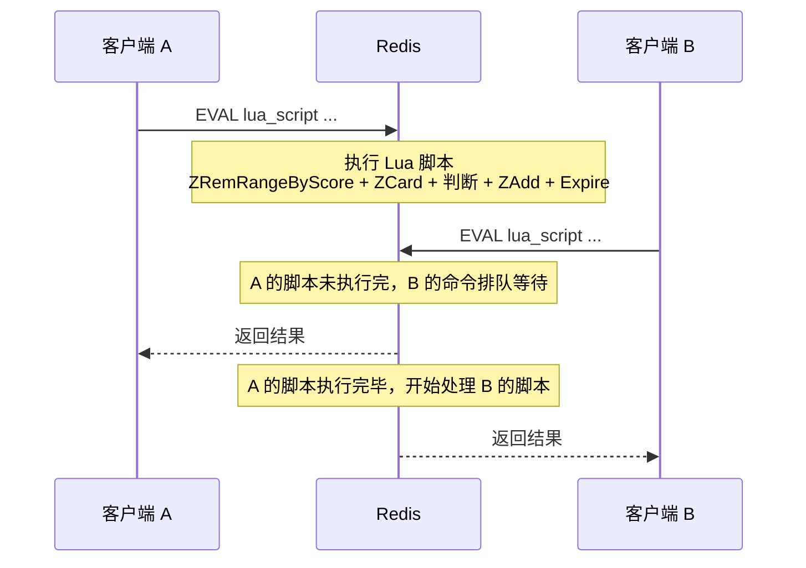

# Redis 滑动窗口限流测试

## 一、问题发现

限流方案最初采用 **Redis Pipeline** 实现，但在并发压力测试中暴露了严重的超发问题：设定阈值为 3 时，100 并发请求实际通过了 3~5 个；设定阈值为 5 时，200 并发请求实际通过了 11 个。最终改用 **Redis Lua 脚本**后，同样测试条件下通过数严格等于阈值，问题彻底消除。

本文将从测试方法、测试结果、根因分析三个维度，解释 Pipeline 为什么会超发，以及 Lua 脚本是如何做到原子性保障的。

---

## 二、测试方法

所有测试使用 `miniredis`（内存级 Redis 替代）+ `testify/assert` 断言库，在 `service/reservation/middleware/ratelimit_test.go` 中实现。

### 2.1 测试分层

```
┌──────────────────────────────────────────────────┐
│ 4.3.4 降级策略测试                                │
│   Redis 宕机 → 降级行为（放行/拒绝）+ 错误日志      │
├──────────────────────────────────────────────────┤
│ 4.3.3 并发压力测试                                │
│   100~200 并发 → 超发检测 + 原子性验证              │
├──────────────────────────────────────────────────┤
│ 4.3.2 中间件集成测试                              │
│   HTTP 层 → 状态码 429 / 响应体 / 上下文传递        │
├──────────────────────────────────────────────────┤
│ 4.3.1 单元测试                                   │
│   Allow 函数 → 正常通过 / 触发限流 / 窗口滑动 /     │
│   不同用户独立 / 不同接口独立                       │
└──────────────────────────────────────────────────┘
```

### 2.2 测试场景与函数对照

| 文档场景 | 测试函数 | 验证要点 |
|----------|---------|---------|
| 正常通过 | `TestAllow_NormalPass` | 窗口内 3 次请求全部返回 allowed |
| 触发限流 | `TestAllow_ExceedLimit` | 第 4 次请求返回 rejected |
| 窗口滑动后重置 | `TestAllow_WindowSlide` | 等待窗口过期后请求重新允许 |
| 不同用户互不影响 | `TestAllow_DifferentUsersIndependent` | 用户 A 限流不影响用户 B |
| 不同接口互不影响 | `TestAllow_DifferentHandlersIndependent` | 提交接口限流不影响取消接口 |
| 带认证信息的请求 | `TestRateLimitMiddleware_WithAuthenticatedUser` | 从上下文提取 openid 正确限流 |
| IP 级限流 | `TestRateLimitMiddleware_IPDimension` | 不同 IP 独立计数 |
| 响应头与状态码 | `TestRateLimitMiddleware_ResponseHeadersAndStatus` | 429 状态码 + JSON 错误体 + Content-Type |
| 并发超发 | `TestAllow_ConcurrentBurst` | 100 并发/阈值 3，通过数 ≤ 3 |
| Pipeline 原子性 | `TestAllow_PipelineAtomicity` | 200 并发/阈值 5，ZSet 成员数与通过数一致 |
| Redis 宕机降级 | `TestRateLimitMiddleware_RedisDown_FailOpen` | FailOpen 放行 + 错误日志被记录 |

### 2.3 并发测试的关键代码

```go
func TestAllow_ConcurrentBurst(t *testing.T) {
    m := setupMiniredis(t)
    defer m.Close()
    client := newTestRedisClient(m)

    window := 60 * time.Second
    max := int64(3)
    key := "ratelimit:test:concurrent:burst"

    var wg sync.WaitGroup
    var passCount int64

    // 并发发起 100 次请求
    for i := 0; i < 100; i++ {
        wg.Add(1)
        go func() {
            defer wg.Done()
            allowed, err := Allow(client, key, window, max)
            assert.NoError(t, err)
            if allowed {
                atomic.AddInt64(&passCount, 1)
            }
        }()
    }

    wg.Wait()
    assert.LessOrEqual(t, passCount, max, "并发下通过的请求数不应超过阈值")
}
```

---

## 三、测试结果

### 3.1 Pipeline 方案（原始实现）

Pipeline 实现的核心代码：

```go
func Allow(redisClient *redis.Client, key string, window time.Duration, max int64) (bool, error) {
    // ...
    pipe := redisClient.Pipeline()
    pipe.ZRemRangeByScore(ctx, key, "0", windowStart)  // 1. 清理过期
    countCmd := pipe.ZCard(ctx, key)                     // 2. 统计数
    pipe.ZAdd(ctx, key, &redis.Z{...})                   // 3. 写入记录
    pipe.Expire(ctx, key, window)                         // 4. 设置过期
    _, err := pipe.Exec(ctx)                              // 5. 批量发送

    currentCount := countCmd.Val()
    if currentCount >= max {
        return false, nil   // 拒绝（但 ZAdd 已经执行了）
    }
    return true, nil
}
```

测试结果（5 次运行）：

| 运行次数 | 阈值 | 并发数 | 实际通过 | 结果 |
|---------|------|-------|---------|------|
| 1 | 3 | 100 | 3 | PASS |
| 2 | 3 | 100 | 4 | **FAIL** |
| 3 | 3 | 100 | 5 | **FAIL** |
| 4 | 3 | 100 | 3 | PASS |
| 5 | 3 | 100 | 3 | PASS |

| 运行次数 | 阈值 | 并发数 | 实际通过 | ZSet 成员数 | 结果 |
|---------|------|-------|---------|-----------|------|
| 1 | 5 | 200 | 11 | 200 | **FAIL** |
| 2 | 5 | 200 | 10 | 200 | **FAIL** |
| 3 | 5 | 200 | 7 | 200 | **FAIL** |

**两个问题**：
1. 通过数不稳定，经常超过阈值（超发）
2. ZSet 成员数 = 总请求数（被拒绝的请求也被写入了 ZSet，计数漂移）

### 3.2 Lua 脚本方案（最终实现）

测试结果（5 次运行）：

| 运行次数 | 阈值 | 并发数 | 实际通过 | ZSet 成员数 | 结果 |
|---------|------|-------|---------|-----------|------|
| 1 | 3 | 100 | 3 | 3 | PASS |
| 2 | 3 | 100 | 3 | 3 | PASS |
| 3 | 3 | 100 | 3 | 3 | PASS |
| 4 | 3 | 100 | 3 | 3 | PASS |
| 5 | 3 | 100 | 3 | 3 | PASS |

| 运行次数 | 阈值 | 并发数 | 实际通过 | ZSet 成员数 | 结果 |
|---------|------|-------|---------|-----------|------|
| 1 | 5 | 200 | 5 | 5 | PASS |
| 2 | 5 | 200 | 5 | 5 | PASS |
| 3 | 5 | 200 | 5 | 5 | PASS |
| 4 | 5 | 200 | 5 | 5 | PASS |
| 5 | 5 | 200 | 5 | 5 | PASS |

结果完全稳定，通过数严格等于阈值，ZSet 成员数与通过数一致，无计数漂移。

`go test -race` 也没有检测到任何数据竞争。

---

## 四、根因分析：Pipeline 为什么会超发

### 4.1 Pipeline 的工作方式

Pipeline 将多个 Redis 命令打包成一次网络请求发送，减少往返延迟。但它**不是原子操作**：

```
客户端 A:  ──[ZRemRange, ZCard, ZAdd, Expire]──→  Redis
客户端 B:  ──[ZRemRange, ZCard, ZAdd, Expire]──→  Redis
```

Go 的 redis 客户端使用连接池，不同 goroutine 的 Pipeline 可能使用不同的 TCP 连接。Redis 虽然是单线程处理命令，但它**逐条处理**来自不同连接的命令，而不是逐个 Pipeline 处理。

### 4.2 命令交错导致超发

当两个 Pipeline 的命令到达 Redis 时，实际的执行顺序可能是**交错**的：

```
时间轴 →

连接 A:  ZRemRange → ZCard →                        ZAdd → Expire
连接 B:            ZRemRange → ZCard →        ZAdd →              Expire
                    ↑                        ↑
                    A和B的ZCard都看到count=0   两个ZAdd都执行了
```

具体步骤：

| 步骤 | 执行的命令 | ZSet 状态 | 说明 |
|------|-----------|----------|------|
| 1 | A: ZRemRangeByScore | 空 | 清理过期记录 |
| 2 | A: ZCard → **0** | 空 | A 统计到 0 条记录 |
| 3 | B: ZRemRangeByScore | 空 | 清理过期记录 |
| 4 | B: ZCard → **0** | 空 | B 也统计到 0 条记录（A 还没写入） |
| 5 | A: ZAdd(memberA) | {memberA} | A 写入记录 |
| 6 | B: ZAdd(memberB) | {memberA, memberB} | B 也写入记录 |
| 7 | A: Expire | {memberA, memberB} | 设置过期 |
| 8 | B: Expire | {memberA, memberB} | 设置过期 |

**结果**：A 和 B 的 `ZCard` 都返回 0，两边都判定"未超限"，两个请求全部通过。如果阈值是 1，本应只放行 1 个，实际放行了 2 个。

这就是 Pipeline 超发的根本原因——**读取（ZCard）和写入（ZAdd）之间存在时间间隙，其他连接的命令可以插入其中，导致基于过时计数做出判断**。

### 4.3 被拒绝请求也被写入的问题

Pipeline 方案的另一个问题是：`ZAdd` 在 Pipeline 中无条件执行，而判断逻辑在 Go 代码端（Pipeline 执行之后）。这意味着即使请求被拒绝，它的记录已经被写入了 ZSet：

```go
pipe.ZAdd(ctx, key, ...)   // 总是会执行
_, err := pipe.Exec(ctx)   // 批量执行，ZAdd 已写入
if currentCount >= max {
    return false, nil       // 拒绝，但 ZSet 里已经有了这条记录
}
```

后果：ZSet 中的成员数 = 总请求数（包括被拒绝的），计数持续膨胀，导致后续请求更容易被拒绝（"过于保守"）。

### 4.4 为什么串行测试没问题

当请求是逐个串行发送时，每个 Pipeline 执行完 ZAdd 后，下一个 Pipeline 的 ZCard 才能看到上一条记录，所以计数是准确的：

```
请求1: ZRemRange → ZCard(0) → ZAdd(m1) → Expire   → 通过
请求2: ZRemRange → ZCard(1) → ZAdd(m2) → Expire   → 通过
请求3: ZRemRange → ZCard(2) → ZAdd(m3) → Expire   → 通过
请求4: ZRemRange → ZCard(3) → ZAdd(m4) → Expire   → 拒绝（3 ≥ 3）
```

但并发场景下，多个请求的 Pipeline 命令会交错，打破了这个假设。

---

## 五、Lua 脚本为什么没有这个问题

### 5.1 Redis Lua 的执行模型

Redis 执行 Lua 脚本时有一个关键保证：**脚本执行期间，Redis 不会处理任何其他客户端的命令**。整个脚本作为一个不可分割的原子操作运行。



### 5.2 对比：Pipeline vs Lua 的执行时序

```
Pipeline 方案（命令可以交错）：

连接A: ── ZRemRange ── ZCard(0) ────────────── ZAdd ── Expire ──
连接B: ─────────────── ZRemRange ── ZCard(0) ── ZAdd ── Expire ──
                       ↑ A还没写入，B看到的是过时的计数

Lua 脚本方案（原子执行，不可交错）：

连接A: ── [ZRemRange → ZCard(0) → 判断 → ZAdd → Expire] ──────
连接B: ───────────────── 等待A完成 ──────────── [ZRemRange → ZCard(1) → 判断 → 拒绝] ──
                          ↑ A的脚本执行完，B的ZCard看到count=1
```

### 5.3 Lua 脚本的实现

```lua
local key = KEYS[1]
local window = tonumber(ARGV[1])
local max_requests = tonumber(ARGV[2])
local now = tonumber(ARGV[3])
local member = ARGV[4]
local window_start = now - window

-- 1. 删除窗口外的过期记录
redis.call('ZREMRANGEBYSCORE', key, 0, window_start)

-- 2. 统计当前窗口内的请求数量
local count = redis.call('ZCARD', key)

-- 3. 判断是否超限，若超限则不写入直接拒绝
if count >= max_requests then
    return 0    -- 拒绝，且不写入 ZSet
end

-- 4. 写入本次请求记录
redis.call('ZADD', key, now, member)

-- 5. 设置 Key 过期时间
redis.call('EXPIRE', key, window)

return 1    -- 允许
```

### 5.4 Lua 脚本解决了 Pipeline 的两个问题

| 问题 | Pipeline | Lua 脚本 |
|------|---------|---------|
| 读取与写入之间的时间间隙 | 命令交错导致 ZCard 看到过时计数 | 脚本内全部命令原子执行，无间隙 |
| 被拒绝请求写入 ZSet | ZAdd 在 Pipeline 中无条件执行 | `if count >= max` 后直接 `return 0`，不执行 ZAdd |
| 并发超发 | 多个连接的命令交错，导致超限通过 | 脚本执行期间其他客户端排队等待 |
| ZSet 计数漂移 | ZSet 成员数 = 总请求数 | ZSet 成员数 = 通过的请求数 |

### 5.5 Go 端调用方式

```go
var rateLimitScript = redis.NewScript(`
    -- Lua 脚本内容
`)

func Allow(redisClient *redis.Client, key string, window time.Duration, max int64) (bool, error) {
    ctx := redisClient.Context()
    now := time.Now().Unix()
    member := fmt.Sprintf("%d:%d", now, rand.Intn(100000))

    result, err := rateLimitScript.Run(ctx, redisClient, []string{key},
        int64(window.Seconds()),  // ARGV[1]: 窗口大小
        max,                      // ARGV[2]: 最大请求数
        now,                      // ARGV[3]: 当前时间戳
        member,                   // ARGV[4]: 唯一成员标识
    ).Int64()

    if err != nil {
        return false, fmt.Errorf("lua script exec failed: %w", err)
    }
    return result == 1, nil
}
```

`redis.NewScript` 会自动处理 `EVAL`（首次）和 `EVALSHA`（后续）的优化，无需手动管理脚本缓存。

---

## 六、完整测试结果

```
=== RUN   TestAllow_NormalPass                            --- PASS
=== RUN   TestAllow_ExceedLimit                           --- PASS
=== RUN   TestAllow_WindowSlide                           --- PASS (2.00s)
=== RUN   TestAllow_DifferentUsersIndependent             --- PASS
=== RUN   TestAllow_DifferentHandlersIndependent          --- PASS
=== RUN   TestRateLimitMiddleware_WithAuthenticatedUser   --- PASS
=== RUN   TestRateLimitMiddleware_IPDimension             --- PASS
=== RUN   TestRateLimitMiddleware_ResponseHeadersAndStatus --- PASS
=== RUN   TestAllow_ConcurrentBurst                       --- PASS (通过 3/100)
=== RUN   TestAllow_PipelineAtomicity                     --- PASS (允许 5, ZSet成员数 5)
=== RUN   TestRateLimitMiddleware_RedisDown_FailOpen      --- PASS
=== RUN   TestRateLimitMiddleware_RedisDown_FailClosed    --- PASS
=== RUN   TestGenerateLimitKey_UserDimension              --- PASS
=== RUN   TestGenerateLimitKey_IPDimension                --- PASS
=== RUN   TestGenerateLimitKey_Anonymous                  --- PASS
PASS
```

`go test -race` 无数据竞争报告。

---

## 七、总结

| 维度 | Pipeline | Lua 脚本 |
|------|---------|---------|
| 原子性 | 非原子，命令可跨连接交错 | 原子，脚本执行期间 Redis 阻塞其他客户端 |
| 并发正确性 | 超发（阈值 3 时实际通过 3~5 个） | 严格准确（阈值 3 时通过 3 个） |
| ZSet 一致性 | 被拒绝请求也写入，计数漂移 | 仅允许的请求写入，无漂移 |
| 网络往返 | 1 次（批量发送） | 1 次（EVAL/EVALSHA） |
| 性能 | 略快（无脚本解析开销） | 极接近（EVALSHA 复用脚本缓存） |
| 适用场景 | 低并发、对超发容忍度高 | 高并发、要求严格限流 |

**结论**：对于限流场景，正确性优先于微小的性能差异。Lua 脚本以几乎相同的网络开销，换来了严格的原子性保证，是更合适的选择。
