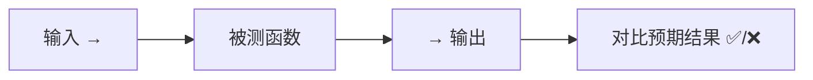
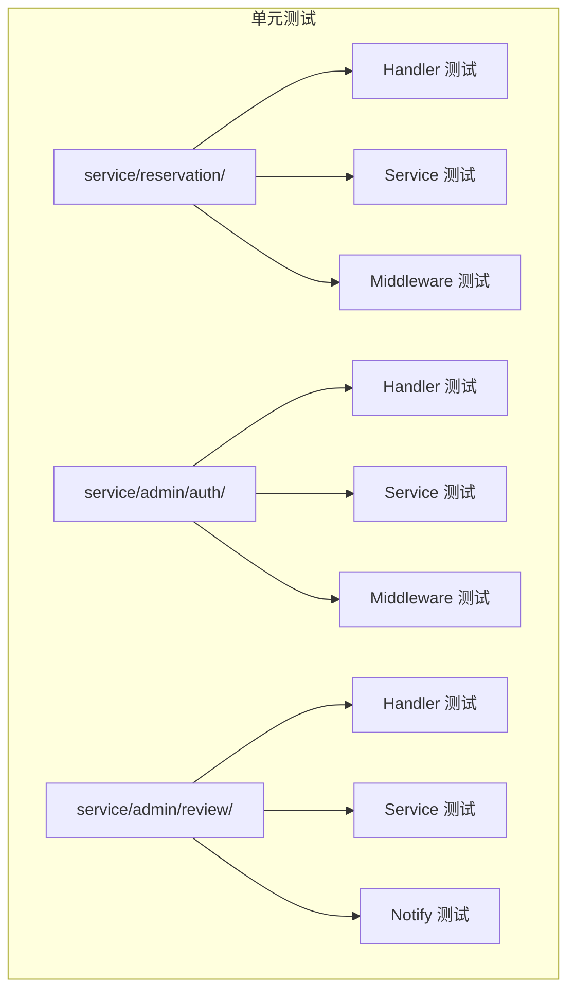
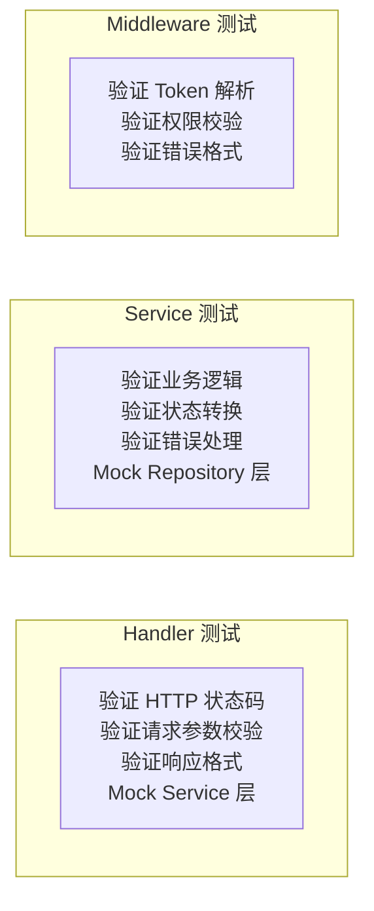

# 单元测试

## 一、什么是单元测试

单元测试是针对**单个函数或方法**的测试，验证它在各种输入下是否返回期望的结果。

打个比方：盖房子时，你不会等整栋楼盖完再检查每根钢筋是否合格——你会提前测试每一根钢筋。单元测试就是"验钢筋"的过程。



### 为什么需要单元测试

| 没有单元测试 | 有单元测试 |
|-------------|-----------|
| 改一行代码，手动点十几下验证 | 改完敲 `go test`，3 秒出结果 |
| 修一个 bug，可能引入一个新 bug | 跑全部测试，立刻知道有没有改坏其他地方 |
| 新人不敢改旧代码 | 有测试保护，放心重构 |

### 单元测试 vs 其他测试

| 维度 | 单元测试 | 集成测试 | API 测试 |
|------|---------|---------|---------|
| **测试对象** | 单个函数 | 代码 + 数据库 | 完整 HTTP 请求 |
| **依赖** | Mock 模拟 | 真实 MySQL | Mock + HTTP |
| **速度** | 毫秒级 | 秒级 | 毫秒级 |
| **目的** | 验证业务逻辑 | 验证 SQL/事务 | 验证 HTTP 层 |

---

## 二、Go 测试基础

### 测试文件命名

Go 规定测试文件必须以 `_test.go` 结尾。比如 `service.go` 的测试文件叫 `service_test.go`。

### 最简单的测试

```go
package math

import "testing"

func TestAdd(t *testing.T) {
    result := Add(1, 2)
    if result != 3 {
        t.Errorf("期望 3，得到 %d", result)
    }
}
```

规则：
- 函数名以 `Test` 开头，后接被测函数名
- 参数是 `*testing.T`
- 用 `t.Error` / `t.Errorf` 报告失败

### 运行测试

```sh
# 运行当前包的所有测试
go test ./service/reservation/...

# 显示详细输出（列出每个用例的名字和结果）
go test -v ./service/reservation/...

# 只运行某个测试函数
go test -v -run TestSubmitHandler ./service/reservation/...

# 禁用缓存（每次真正执行）
go test -v -count=1 ./service/reservation/...
```

---

## 三、本项目使用的测试工具

### 3.1 testify — 断言库

Go 标准库只提供 `t.Error`，写起来很啰嗦。`testify` 提供了更丰富的断言方法：

```go
import "github.com/stretchr/testify/assert"

// 标准库写法
if got != 200 {
    t.Errorf("期望 200，得到 %d", got)
}

// testify 写法
assert.Equal(t, 200, got)
assert.Contains(t, msg, "成功")
assert.NoError(t, err)
assert.NotZero(t, order.ID)
```

常用断言：

| 断言 | 用途 |
|------|------|
| `assert.Equal(t, expected, actual)` | 判断两个值相等 |
| `assert.NoError(t, err)` | 判断没有错误 |
| `assert.Error(t, err)` | 判断有错误 |
| `assert.Contains(t, str, substr)` | 判断字符串包含 |
| `assert.Len(t, slice, length)` | 判断切片长度 |
| `assert.NotZero(t, val)` | 判断值不为零 |

### 3.2 gomock — Mock 框架

Mock 的意思是"模拟对象"。被测函数可能依赖数据库、gRPC 接口等外部系统，单元测试不应该真去连数据库——太慢且不可控。所以用 Mock 代替真实对象。

```
真实调用：Service → Repository → MySQL（需要数据库）
Mock 调用：Service → MockRepository ─│（不需要数据库，返回预定数据）
```

本项目使用手写 Mock，存放在被测试包的同级目录：

```
service/admin/auth/
├── mock_account_client.go   ← Mock gRPC 账号服务客户端
├── service.go
├── service_test.go           ← 注入 Mock 进行测试
└── testutil_test.go          ← TestMain 初始化 JWT

service/admin/review/
├── mock_notify_client.go     ← Mock gRPC 通知服务客户端
├── mock_repository.go        ← Mock 数据库操作
├── handler_test.go
├── notify_handler_test.go
└── service_test.go
```

Mock 示例（手写 mock）：

```go
// MockAccountServiceClient 模拟 gRPC 账号服务
type MockAccountServiceClient struct {
    ctrl     *gomock.Controller
    recorder *MockAccountServiceClientMockRecorder
}

// VerifyAdmin 模拟登录验证
func (m *MockAccountServiceClient) VerifyAdmin(ctx context.Context, in *pb.VerifyAdminReq, opts ...grpc.CallOption) (*pb.VerifyAdminResp, error) {
    m.ctrl.T.Helper()
    ret := m.ctrl.Call(m, "VerifyAdmin", ctx, in)
    ret0, _ := ret[0].(*pb.VerifyAdminResp)
    ret1, _ := ret[1].(error)
    return ret0, ret1
}
```

在测试中使用 Mock：

```go
func TestLogin(t *testing.T) {
    ctrl := gomock.NewController(t)        // 创建控制器
    defer ctrl.Finish()                     // 测试结束时检查所有期望都完成

    mockClient := NewMockAccountServiceClient(ctrl)  // 创建 Mock

    // 设置期望：当 VerifyAdmin 被调用时返回成功
    mockClient.EXPECT().
        VerifyAdmin(gomock.Any(), gomock.Any()).
        Return(&pb.VerifyAdminResp{Success: true, AdminId: 1}, nil)

    svc := NewAdminAuthService(mockClient)

    resp, err := svc.Login(context.Background(), &adminauth.LoginReq{
        Username: "admin", Password: "123456",
    })
    assert.NoError(t, err)
    assert.True(t, resp.Success)
}
```

### 3.3 httptest — HTTP 请求模拟

不需要真正启动服务器，直接在内存中测试 HTTP 请求和响应：

```go
import "net/http/httptest"

// 创建测试请求
req := httptest.NewRequest("POST", "/api/reservation/reservation/submit", strings.NewReader(body))
req.Header.Set("Content-Type", "application/json")
req.Header.Set("Authorization", "Bearer "+token)

// 创建响应记录器
w := httptest.NewRecorder()

// 发送请求（通过 Gin 路由）
r.ServeHTTP(w, req)

// 验证响应
assert.Equal(t, 200, w.Code)            // HTTP 状态码
var resp Response
json.Unmarshal(w.Body.Bytes(), &resp)   // 解析响应体
assert.Equal(t, 200, resp.Code)
```

### 3.4 Gin TestMode

测试中使用 Gin 的测试模式，关闭日志输出：

```go
gin.SetMode(gin.TestMode)
r := gin.New()
```

---

## 四、本项目测试结构

### 4.1 整体结构



### 4.2 分层测试职责



### 4.3 TestMain — 包级别初始化

Go 测试支持 `TestMain` 函数，在所有测试运行前执行一次，用于全局初始化（如 JWT 密钥）：

```go
func TestMain(m *testing.M) {
    // 初始化 JWT（必须在使用 token 的任何测试之前执行）
    jwt.InitUserJWT("test-secret-key", 24)
    // 运行所有测试
    os.Exit(m.Run())
}
```

> TestMain 在每个包中最多只有一个，且作用于当前包的全部测试。

### 4.4 子测试 — 一条用例验证一个场景

Go 支持用 `t.Run()` 创建子测试，每个子测试验证一个场景：

```go
func TestLogin(t *testing.T) {
    t.Run("成功登录", func(t *testing.T) { /* ... */ })
    t.Run("密码错误", func(t *testing.T) { /* ... */ })
    t.Run("缺少请求体", func(t *testing.T) { /* ... */ })
    t.Run("无 Token", func(t *testing.T) { /* ... */ })
}
```

运行子测试：

```sh
# 运行 TestLogin 及其所有子测试
go test -v -run TestLogin ./service/admin/auth/...

# 只运行"密码错误"这个子测试
go test -v -run TestLogin/密码错误 ./service/admin/auth/...
```

---

## 五、各模块测试覆盖

### 5.1 用户预约模块（service/reservation/）

| 测试文件 | 测试内容 |
|----------|---------|
| `service_test.go` | Submit 提交预约（正常/超时段/时间格式错）、Cancel 取消（成功/非本人/数据库错误）、GetMyReservations 查询、GetOccupiedSlots 查询已占用时段、GetOrderByID 按 ID 查询、GenerateOrderNo 订单号格式验证 |
| `handler_test.go` | HTTP 层 Submit/Cancel/GetMyReservations/GetOccupiedSlots 的请求校验和响应格式，数据库错误回退处理 |
| `middleware/middleware_test.go` | Token 验证中间件：无 header、格式错误、无效 token、有效 token |

### 5.2 管理员认证模块（service/admin/auth/）

| 测试文件 | 测试内容 |
|----------|---------|
| `service_test.go` | Login 登录（成功/gRPC错误/凭证错误） |
| `handler_test.go` | 登录接口请求校验、获取管理员信息（成功/未登录） |
| `middleware_test.go` | Admin 认证中间件（无 header/格式错/无效 token/有效 token）、角色中间件（无管理员信息/角色不匹配/角色匹配） |

### 5.3 管理员审核模块（service/admin/review/）

| 测试文件 | 测试内容 |
|----------|---------|
| `service_test.go` | 一级审核（通过/驳回/订单不存在/状态错误/乐观锁失败）、二级审核（通过/驳回/订单不存在/状态错误）、设置密码、查询订单详情、按状态筛选、分页 |
| `handler_test.go` | 订单列表、订单详情、一级/二级审核接口、设置密码接口的 HTTP 层校验 |
| `notify_handler_test.go` | 发送通知（成功/未登录/角色错误/订单不存在/状态错误/无密码/gRPC错误）、驳回通知、时段转通知格式 |

### 5.4 Gateway 认证模块（service/gateway/auth/）

| 测试文件 | 测试内容 |
|----------|---------|
| `handler_test.go` | 用户登录、管理员登录的 HTTP 校验 |
| `middleware_test.go` | 认证中间件 |
| `service_test.go` | 登录业务逻辑 |

---

## 六、运行命令速查

```sh
# 运行所有服务的单元测试
go test ./service/... -v -count=1

# 只运行 reservation 包的测试
go test ./service/reservation/... -v -count=1

# 只运行 admin/auth 包的测试
go test ./service/admin/auth/... -v -count=1

# 只运行 admin/review 包的测试
go test ./service/admin/review/... -v -count=1

# 运行某个测试函数
go test -v -run TestReservationHandler_Submit ./service/reservation/...

# 运行某个子测试（注意：子测试名用 / 分隔）
go test -v -run TestAuthMiddleware/invalid_token ./service/reservation/middleware/...

# 查看测试覆盖率
go test -cover ./service/...
```

---

## 七、编写新单元测试的步骤

1. **确定测试对象**：是 Handler、Service 还是 Middleware？
2. **创建测试文件**：在目标文件同目录创建 `xxx_test.go`
3. **准备 Mock**：如果被测代码依赖接口（如 Repository、gRPC Client），使用已有的 Mock 或创建新的
4. **编写 TestMain**（如果需要包级初始化）：初始化 JWT 等全局状态
5. **编写测试用例**：
   - 设置 Mock 的期望（EXPECT）
   - 构造输入参数
   - 调用被测函数
   - 用 assert 验证结果
6. **覆盖正常路径 + 异常路径**：至少测一个"成功"和一个"失败"

---

## 八、常见问题

### 测试缓存导致"不执行"

Go 会缓存测试结果，如果代码没改，第二次运行会显示 `(cached)`。解决办法：

```sh
go test -count=1 ./...    # 禁用缓存
```

### 如何知道哪些代码没被测试覆盖

```sh
go test -cover ./service/reservation/...
# 输出：ok  reservation-sys/service/reservation  0.008s  coverage: 85.0% of statements
```

### Mock 调用次数不匹配

gomock 默认期望被调用一次。如果 Mock 方法没被调用（会 panic），或调用了多次，测试会失败。查看错误信息中的 `controller.go` 堆栈就能定位。

### 测试间数据污染

如果多个测试共享全局变量，要注意重置状态。本项目每个测试都创建新的 Mock Controller 和 Service 实例，避免了这个问题。
