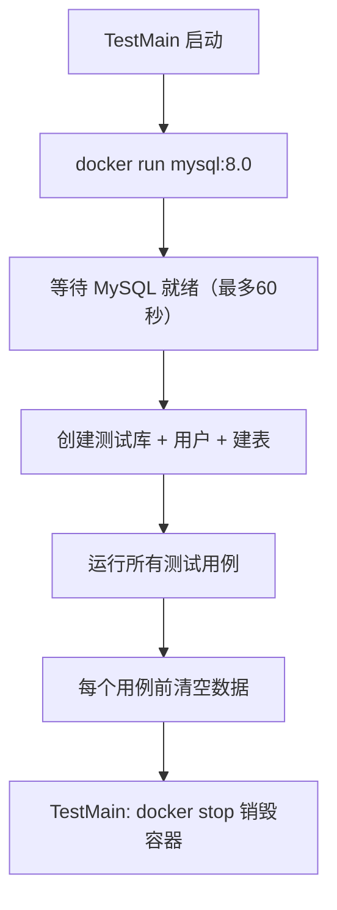

# 数据库集成测试

## 一、单元测试 vs 集成测试

### 它们的区别

| 维度 | 单元测试 | 集成测试 |
|------|---------|---------|
| **测试对象** | 单个函数/方法 | 代码 + 真实数据库 |
| **数据库** | 不需要，用 Mock 模拟 | 需要真实 MySQL |
| **测试速度** | 毫秒级 | 秒级（需要启动 Docker 容器） |
| **能发现的问题** | 业务逻辑错误 | SQL 语法错误、事务回滚失败、行锁失效、乐观锁条件不对等 |
| **本项目位置** | `service/*/xxx_test.go` | `tests/integration/` |

### 为什么 Mock 不够？

Mock 能验证"你调用了正确的方法"，但**无法验证**：

- SQL 语句是否写对了（拼写错误、字段名不匹配）
- 事务是否真的能回滚（`BEGIN` / `ROLLBACK` 是否生效）
- 行锁 `SELECT ... FOR UPDATE` 是否真能防止并发双重预约
- 乐观锁 `WHERE status = ?` 是否真能防止状态覆盖
- 外键约束、唯一索引是否生效

> **一句话**：Mock 告诉你"逻辑对不对"，集成测试告诉你"能不能跑通"。

---

## 二、实现方案：Docker + TestMain 共享容器

### 为什么不用 testcontainers-go

testcontainers-go 是最流行的方案，但在某些网络环境下无法拉取依赖。本项目采用**直接调用 Docker CLI** 的方式，效果完全一样：



### 核心文件

```
tests/integration/
├── setup_test.go               ← 容器生命周期管理（TestMain）
└── reservation_repo_test.go    ← 10 个 Repository 集成测试
```

### setup_test.go 解读

```go
// 包级别变量：所有测试共享同一个 MySQL 连接
var (
    testDBPort string   // 随机端口，避免与本地 MySQL 冲突
    testDSN    string   // 数据库连接字符串
    cleanupFn  func()   // 销毁容器的回调
)

func TestMain(m *testing.M) {
    // 1. 随机端口（33070 ~ 33169），避免冲突
    testDBPort = fmt.Sprintf("%d", 33070+rand.Intn(100))

    // 2. 启动 MySQL 容器，返回连接字符串
    testDSN, cleanupFn = setupMySQLContainer()

    // 3. 运行所有测试
    code := m.Run()

    // 4. 清理：停止并删除容器
    cleanupFn()
    os.Exit(code)
}
```

### 容器启动流程

```go
func setupMySQLContainer() (string, func()) {
    // 1. 用 docker run 启动 MySQL 8.0 容器
    cmd := exec.Command("docker", "run", "-d", "--rm",
        "--name", containerName,
        "-e", "MYSQL_ROOT_PASSWORD=root123",
        "-p", testDBPort+":3306",       // 端口映射
        "mysql:8.0",
        "--default-authentication-plugin=mysql_native_password",
    )

    // 2. 轮询等待 MySQL 就绪（最多60秒）
    for i := 0; i < 60; i++ {
        db, err = gorm.Open(mysql.Open(rootDSN), &gorm.Config{})
        if err == nil { break }
        time.Sleep(time.Second)
    }

    // 3. 创建测试数据库和用户
    db.Exec("CREATE DATABASE IF NOT EXISTS home_res ...")
    db.Exec("CREATE USER IF NOT EXISTS 'res_user'@'%' ...")
    db.Exec("GRANT ALL PRIVILEGES ON home_res.* TO 'res_user'@'%'")

    // 4. 用 GORM 执行建表 SQL（与生产环境 init.sql 结构一致）
    runInitSQL(testDB)

    return userDSN, cleanup
}
```

### 数据隔离：每个测试前清空

```go
func setupRepo(t *testing.T) (reservationdb.Repository, func()) {
    db, _ := gorm.Open(mysql.Open(testDSN), &gorm.Config{})
    repo := reservationdb.NewRepository(db)

    cleanup := func() {
        db.Exec("DELETE FROM review_records")
        db.Exec("DELETE FROM reservation_slots")
        db.Exec("DELETE FROM reservation_orders")
    }
    return repo, cleanup
}
```

每个测试函数调用 `setupRepo(t)` 获得独立的 Repository 实例，测试结束后执行 `cleanup()` 清空三张表，保证测试间数据互不干扰。

---

## 三、测试用例覆盖

### 创建订单 + 行锁

| 测试函数 | 场景 | 验证点 |
|---------|------|--------|
| `TestCreateOrderWithLock_Success` | 正常创建订单 | 订单ID自动生成、时段ID自动填充、关联正确 |
| `TestCreateOrderWithLock_Conflict` | 时段冲突 | 重叠时段返回"已被预约"错误 |

### 查询

| 测试函数 | 场景 | 验证点 |
|---------|------|--------|
| `TestFindOrderByID` | 按 ID 查询 | 预加载时段正确（2个时段）、不存在的ID返回错误 |
| `TestFindSlotsByTimeRange` | 时间区间交集查询 | 有交集返回数据、无交集返回空 |
| `TestListOrders` | 分页 + 按状态筛选 | 总数正确、分页限制生效、状态筛选准确 |

### 乐观锁（状态更新）

| 测试函数 | 场景 | 验证点 |
|---------|------|--------|
| `TestUpdateOrderStatus_OptimisticLock` | 乐观锁机制 | 第一次更新成功、第二次用旧状态更新失败（状态已变） |

### 取消订单

| 测试函数 | 场景 | 验证点 |
|---------|------|--------|
| `TestCancelOrder` | 正常取消 | 订单和时段状态都变为已取消 |
| `TestCancelOrder_WrongUser` | 非本人取消 | 返回权限错误 |

### 时段密码

| 测试函数 | 场景 | 验证点 |
|---------|------|--------|
| `TestSetSlotPassword` | 仅为已通过时段设置密码 | 待审核状态设密码失败、已通过后设密码成功 |

### 审核记录

| 测试函数 | 场景 | 验证点 |
|---------|------|--------|
| `TestCreateReviewRecord` | 创建审核记录 | 记录ID自动生成、可按订单ID查询到 |

---

## 四、运行集成测试

### 前提条件

- 已安装 Docker
- Docker daemon 正在运行（`docker info` 不出错）
- 能拉取 `mysql:8.0` 镜像（首次运行自动拉取）

### 运行命令

```sh
# 运行全部集成测试
go test ./tests/integration/... -v -count=1

# 运行单个测试
go test ./tests/integration/... -v -run TestCreateOrderWithLock_Success

# 指定超时时间（默认120秒足够，容器启动较慢可适当延长）
go test ./tests/integration/... -v -count=1 -timeout 300s
```

### 预期输出

```
=== RUN   TestCreateOrderWithLock_Success
--- PASS: TestCreateOrderWithLock_Success (0.08s)
=== RUN   TestCreateOrderWithLock_Conflict
--- PASS: TestCreateOrderWithLock_Conflict (0.07s)
=== RUN   TestFindOrderByID
--- PASS: TestFindOrderByID (0.07s)
...
=== RUN   TestListOrders
--- PASS: TestListOrders (0.10s)
PASS
ok  	reservation-sys/tests/integration	30.205s
```

> 注意：总耗时约 30 秒主要是容器启动时间（MySQL 启动 + 建库 + 建表），每个测试本身的执行时间不到 0.1 秒。

---

## 五、测试间数据隔离原理

```
TestMain 启动 → 启动 MySQL 容器 → 建表
    ├── TestA: repo.Setup() → 跑测试 → cleanup 清空数据
    ├── TestB: repo.Setup() → 跑测试 → cleanup 清空数据
    └── TestC: repo.Setup() → 跑测试 → cleanup 清空数据
TestMain 结束 → docker stop 销毁容器
```

每个测试函数调用 `setupRepo()` 获得一个 Repository 实例。`setupRepo` 返回的 cleanup 函数会在测试结束后删除表中的所有数据（但不删表）。

这样保证了：
- 同一包内的测试可以**并行运行**（虽然本项目使用串行，但数据隔离使得并行成为可能）
- 某个测试插入的数据**不会影响**其他测试
- 测试失败时残留的数据会在下一次 `setupRepo()` 调用时被清理

---

## 六、常见问题

### 1. 容器启动失败：port is already allocated

端口冲突，说明上次测试的容器没清理干净。手动清理：

```sh
# 查找残留的测试容器
docker ps -a --filter "name=reservation-test-mysql"

# 停止并删除
docker stop $(docker ps -a -q --filter "name=reservation-test-mysql")
docker rm $(docker ps -a -q --filter "name=reservation-test-mysql")
```

### 2. 容器启动失败：Cannot connect to the Docker daemon

确保 Docker 正在运行：

```sh
sudo systemctl start docker
# 或者
sudo dockerd &
```

### 3. 容器启动很慢

首次运行需要拉取 `mysql:8.0` 镜像（约 500MB+），后续运行会复用本地镜像。如果网络较慢，可以提前拉取：

```sh
docker pull mysql:8.0
```

### 4. 测试被跳过（SKIP）

如果本机没有 Docker，`skipIfNoDocker()` 会自动跳过所有集成测试：

```
--- SKIP: TestCreateOrderWithLock_Success (0.00s)
    setup_test.go:xxx: Docker 不可用，跳过集成测试
```

### 5. 如何添加新的集成测试

1. 在 `tests/integration/` 下新建 `xxx_test.go`
2. 在测试函数中调用 `setupRepo(t)` 获取 Repository
3. 编写测试逻辑
4. `defer cleanup()` 在测试结束时清理数据

```go
func TestMyNewFeature(t *testing.T) {
    repo, cleanup := setupRepo(t)
    defer cleanup()

    // ... 测试逻辑 ...
}
```
