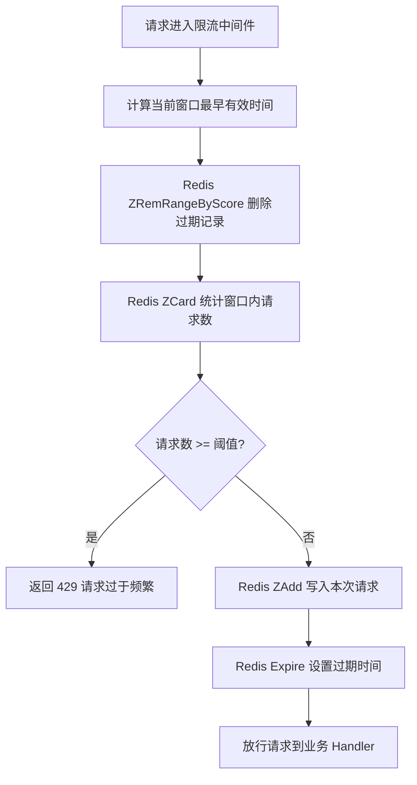

# Redis 滑动窗口限流方案

## 一、问题与目标

场地预约系统的核心接口（如提交预约、取消预约）面临被脚本高频请求攻击的风险。攻击者可能通过伪造请求在短时间内对服务器和数据库造成巨大压力，导致正常用户无法使用系统。

本方案旨在引入基于 Redis 的滑动窗口限流机制，在不影响正常用户体验的前提下，有效拦截恶意高频请求，保护后端服务与数据库的稳定性。

---

## 二、解决方法

本方案采用 **Redis Sorted Set（ZSet）** 实现滑动窗口限流，部署在 Reservation 服务的 Gin 中间件层，为敏感接口提供用户级和 IP 级双重限流防护。

### 2.1 运行流程

每次请求进入限流中间件时，通过 **Redis Lua 脚本**在服务端原子执行以下步骤：

1. **计算时间边界**：获取当前时间戳，计算出当前窗口的最早有效时间（当前时间减去窗口持续时间）。
2. **清理过期记录**：从对应的 Redis ZSet 中删除所有分值小于窗口最早有效时间的成员。
3. **统计当前窗口请求数**：计算清理后 ZSet 中剩余的成员数量，即为当前窗口内已发生的有效请求次数。
4. **判断是否超限**：将统计出的请求数与预设的最大请求阈值进行比较。
   - 若请求数已达到或超过阈值，则拒绝本次请求，返回"请求过于频繁"的提示，**不**将本次请求写入 ZSet。
   - 若请求数未超过阈值，则允许本次请求通过，并将本次请求的时间戳作为分值、唯一标识作为成员写入 ZSet。
5. **设置过期时间**：为 Redis Key 设置一个与窗口时长相等的过期时间（Expire），确保冷数据能够自动释放。



---

## 三、原理描述

### 3.1 数据结构

采用 Redis 的 **Sorted Set（ZSet）** 数据结构实现滑动窗口。ZSet 中的每个元素包含一个分值（Score）和一个成员（Member），元素按分值自动排序，天然支持范围查询和排序删除。

- **Redis Key**：`ratelimit:{维度}:{标识}:{接口}`，例如 `ratelimit:user:openid001:submit`
- **Score**：请求发生的时间戳（秒级），用于界定请求是否在当前时间窗口内
- **Member**：由时间戳与随机数组合而成（如 `{timestamp}:{random}`，其中 random 为 0~99999 的随机整数），确保同一秒内的多条请求不会产生成员冲突

### 3.2 核心算法伪代码

```
-- KEYS[1] = 限流 Key
-- ARGV[1] = 窗口大小（秒）
-- ARGV[2] = 最大请求数
-- ARGV[3] = 当前时间戳（秒）
-- ARGV[4] = 唯一成员标识（时间戳:随机数）
-- 返回值: 1 = 允许, 0 = 拒绝

local key = KEYS[1]
local window = tonumber(ARGV[1])
local max_requests = tonumber(ARGV[2])
local now = tonumber(ARGV[3])
local member = ARGV[4]
local window_start = now - window

-- 1. 删除窗口外的过期记录
redis.call('ZREMRANGEBYSCORE', key, 0, window_start)

-- 2. 统计当前窗口内的请求数量
local count = redis.call('ZCARD', key)

-- 3. 判断是否超限，若超限则不写入直接拒绝
if count >= max_requests then
    return 0
end

-- 4. 写入本次请求记录
redis.call('ZADD', key, now, member)

-- 5. 设置 Key 过期时间
redis.call('EXPIRE', key, window)

return 1
```

### 3.3 原子性保障

限流核心逻辑要求"检查-后-写入"（Check-Then-Act）是原子操作，否则并发场景下多个请求可能同时读到相同的计数值，全部通过判断，导致实际放行的请求数超过阈值（超发）。

本方案采用 **Redis Lua 脚本** 实现原子性：将清理、统计、判断、写入、设置过期时间全部写在 Lua 脚本中，通过 `EVAL` 命令发送到 Redis 服务端一次性执行。Redis 单线程模型保证 Lua 脚本执行期间不会被其他客户端命令打断，从而彻底消除了竞态窗口。

Lua 脚本文件独立存放在 `middleware/scripts/ratelimit.lua`，Go 侧通过 `//go:embed` 指令在编译时嵌入，并使用 `redis.NewScript()` 注册，调用时一行 `rateLimitScript.Run()` 即可完成原子化限流判断。相比 Pipeline 方案（命令间仍可被其他客户端交错执行），Lua 脚本是低阈值限流场景下唯一正确的方式。

---

## 四、实现方法

### 4.1 架构位置

限流中间件部署在 **Reservation 服务**的 Gin 路由层，作为 HTTP 中间件挂载到需要保护的接口上。用户请求经过认证中间件后，进入限流中间件进行校验，通过后才到达业务 Handler。

```
请求 → Nginx → Gin Router → CORS → AuthMiddleware → RateLimitMiddleware → Handler → Repository → MySQL
```

### 4.2 代码实现

#### 4.2.1 包结构设计

在 `service/reservation/middleware/` 包中新增限流相关代码：

| 文件 | 职责 |
|------|------|
| `middleware/ratelimit.go` | 限流中间件、限流器核心逻辑、限流配置结构体 |
| `middleware/scripts/ratelimit.lua` | 滑动窗口限流 Lua 脚本，通过 `//go:embed` 嵌入 |
| `middleware/ratelimit_test.go` | 限流中间件单元测试、集成测试、并发测试 |

#### 4.2.2 函数设计

**`RateLimitConfig` 结构体**

| 字段 | 类型 | 说明 |
|------|------|------|
| `Window` | `time.Duration` | 时间窗口大小 |
| `MaxRequests` | `int64` | 窗口内允许的最大请求数 |
| `Dimension` | `string` | 限流维度（`user` / `ip`） |
| `KeyPrefix` | `string` | Redis Key 前缀 |
| `HandlerName` | `string` | 接口标识，用于区分不同接口的限流桶（如 `submit`、`cancel`） |
| `FailOpen` | `bool` | Redis 故障时是否放行（`true`=保守降级放行，`false`=高安全模式拒绝） |

**`RateLimitMiddleware(redisClient *redis.Client, config *RateLimitConfig) gin.HandlerFunc`**
- **输入**：Redis 客户端指针、限流配置指针（含窗口大小、最大请求数、限流维度、Key 前缀、接口名、降级策略等）
- **输出**：Gin 中间件函数
- **职责**：为每个请求提取限流键，调用限流器判断是否放行；Redis 故障时根据 `FailOpen` 决定放行或拒绝

**`Allow(redisClient *redis.Client, key string, window time.Duration, max int64) (bool, error)`**
- **输入**：Redis 客户端、限流键、窗口时长、最大请求数
- **输出**：`(是否允许, 错误)`
- **职责**：通过 `redis.NewScript` 执行嵌入的 Lua 脚本，在 Redis 服务端原子完成 ZRemRangeByScore、ZCard、ZAdd、Expire

**`generateLimitKey(c *gin.Context, config *RateLimitConfig) string`**
- **输入**：Gin 上下文、限流配置指针
- **输出**：限流 Redis Key，格式为 `prefix:dimension:identifier:handler`
- **职责**：根据配置中的 Dimension 从上下文中提取 OpenID（用户维度）或客户端 IP（IP 维度），拼接成标准化的限流键；若 OpenID 不存在则回退为 `anonymous`，若 IP 为空则回退为 `unknown`

#### 4.2.3 依赖关系

```
middleware/ratelimit.go
    ├── 依赖 pkg/platform/redis.go 初始化的 *redis.Client
    ├── 依赖 middleware/middleware.go 中 AuthMiddleware 写入上下文的 openid
    ├── 依赖 middleware/scripts/ratelimit.lua（通过 //go:embed 嵌入）
    └── 被 service/reservation/cmd/main.go 中的路由注册调用
```

#### 4.2.4 配置文件修改

**（1）`pkg/config/base.go` — 新增限流配置结构体**

在 `base.go` 中新增 `RateLimitItemConfig`，定义单个限流规则的配置结构：

```go
// RateLimitItemConfig 单条限流规则配置
type RateLimitItemConfig struct {
    HandlerName string `yaml:"handler_name"` // 接口标识，如 submit、cancel
    Dimension   string `yaml:"dimension"`    // 限流维度: user / ip
    WindowSec   int64  `yaml:"window_sec"`   // 窗口大小（秒）
    MaxRequests int64  `yaml:"max_requests"` // 窗口内最大请求数
    FailOpen    bool   `yaml:"fail_open"`    // Redis 故障时是否放行
}
```

**（2）`service/reservation/config/config.go` — Config 增加限流配置字段**

```go
type Config struct {
    Server   baseconfig.ServerConfig          `yaml:"server"`
    MySQL    baseconfig.MySQLConfig           `yaml:"mysql"`
    Redis    baseconfig.RedisConfig           `yaml:"redis"`
    JWT      baseconfig.JwtConfig             `yaml:"jwt"`
    RateLimit []baseconfig.RateLimitItemConfig `yaml:"ratelimit"` // 新增
}
```

**（3）`service/reservation/configs/config_v2.yaml` — 补充 Redis 和限流配置**

```yaml
# ========== 以下为新增内容 ==========

redis:
  host: "redis"
  port: 6379
  password: ""
  db: 0

ratelimit:
  - handler_name: "submit"
    dimension: "user"
    window_sec: 60
    max_requests: 3
    fail_open: true
  - handler_name: "submit"
    dimension: "ip"
    window_sec: 60
    max_requests: 20
    fail_open: true
  - handler_name: "cancel"
    dimension: "user"
    window_sec: 60
    max_requests: 5
    fail_open: true
```

**（4）`service/reservation/cmd/main.go` — 路由注册时挂载限流中间件**

```go
// 初始化 Redis（新增）
redisClient := platform.InitRedis(resconfig.GetRedis())

// 根据配置注册限流中间件（新增，放在 AuthMiddleware 之后、Handler 之前）
for _, rlCfg := range resconfig.GetRateLimit() {
    protected.Use(middleware.RateLimitMiddleware(redisClient, &middleware.RateLimitConfig{
        Window:      time.Duration(rlCfg.WindowSec) * time.Second,
        MaxRequests: rlCfg.MaxRequests,
        Dimension:   rlCfg.Dimension,
        KeyPrefix:   "ratelimit",
        HandlerName: rlCfg.HandlerName,
        FailOpen:    rlCfg.FailOpen,
    }))
}
```

#### 4.2.5 限流维度与配置

| 接口 | 限流维度 | 限流键来源 | 窗口大小 | 最大请求数 |
|------|----------|------------|----------|------------|
| 提交预约 `POST /reservation/submit` | 用户级 | JWT 中的 OpenID | 60 秒 | 3 |
| 提交预约 `POST /reservation/submit` | IP 级 | 客户端真实 IP | 60 秒 | 20 |
| 取消预约 `DELETE /reservation/:id` | 用户级 | JWT 中的 OpenID | 60 秒 | 5 |

### 4.3 测试方法

#### 4.3.1 单元测试

对限流核心逻辑 `Allow` 函数进行单元测试，使用 `miniredis` 作为内存级 Redis 替代，避免依赖真实 Redis 服务。由于 Lua 脚本通过 `redis.NewScript` 在 `Allow` 函数内部调用，`miniredis` 完整支持 Lua 脚本执行，测试覆盖了脚本内的全部逻辑路径：

- **测试场景 1：正常通过**：在窗口内向同一用户发起 3 次请求，验证前 3 次均返回允许。
- **测试场景 2：触发限流**：在窗口内向同一用户发起 4 次请求，验证第 4 次返回拒绝。
- **测试场景 3：窗口滑动后重置**：首次请求后等待窗口过期，使用 `m.FastForward()` 推进 miniredis 内部时钟，再次发起请求，验证允许通过。
- **测试场景 4：不同用户互不影响**：用户 A 触发限流后，验证用户 B 的请求仍然允许。
- **测试场景 5：不同接口互不影响**：同一用户对接口 A 触发限流后，验证对接口 B 的请求仍然允许。
- **测试场景 6：配置是否正确加载**：依赖配置模块的编写。

#### 4.3.2 中间件集成测试

使用 `httptest.NewRecorder()` 配合 Gin 引擎，测试 `RateLimitMiddleware` 的 HTTP 层行为：

- **测试场景 1：带认证信息的请求**：在 Gin 上下文中间件中注入 `openid`，验证中间件能正确提取并限流，并验证 429 响应体包含正确的 `code` 和 `msg`。
- **测试场景 2：IP 级限流**：通过设置 `req.RemoteAddr` 模拟不同来源 IP，验证 IP 维度限流独立生效。
- **测试场景 3：响应头与状态码**：验证触发限流时返回 HTTP 429 状态码、`Content-Type: application/json`、以及包含 `code: 429` 和 `"请求过于频繁"` 提示的 JSON 响应体。

#### 4.3.3 并发压力测试

使用 Go 并发原语验证高并发场景下 Lua 脚本的原子性保障：

- **测试场景 1：并发超发**：在同一时间内并发发起 100 次请求（阈值 3），使用 `sync.WaitGroup` + `atomic.AddInt64` 统计通过次数，验证通过的请求数不超过阈值 3。Lua 脚本在 Redis 服务端单线程原子执行，彻底杜绝超发。
- **测试场景 2：原子性验证**：高并发发起 200 次请求（阈值 5），验证通过数不超过阈值，无 Redis 操作错误，且 ZSet 成员数量与通过请求数一致，确认无计数漂移。

#### 4.3.4 降级策略测试

- **测试场景 1：保守降级（FailOpen）**：Redis 故障时 `FailOpen=true`，验证中间件放行请求并记录错误日志（日志包含 `ratelimit` 和 `Redis 操作失败` 关键字）。
- **测试场景 2：高安全模式（FailClosed）**：Redis 故障时 `FailOpen=false`，验证中间件拒绝请求，返回 HTTP 500 状态码及 `"服务暂时不可用"` 提示。

#### 4.3.5 辅助函数测试

- **`generateLimitKey` 测试**：分别验证用户维度 Key 生成（格式 `ratelimit:user:openid:submit`）、IP 维度 Key 生成、以及无 OpenID 时的 `anonymous` 回退。

#### 4.3.6 测试覆盖范围

| 层级 | 测试类型 | 覆盖目标 |
|------|----------|----------|
| 核心逻辑 | 单元测试 | `Allow` 函数（含 Lua 脚本内全路径） |
| HTTP 中间件 | 集成测试 | 状态码、响应体、Content-Type、上下文传递 |
| 并发安全 | 压力测试 | Lua 脚本原子性、超发漏洞 |
| 容错能力 | 降级测试 | `FailOpen` 放行日志、`FailClosed` 拒绝响应 |
| 辅助函数 | 单元测试 | `generateLimitKey` 各维度 Key 生成与回退 |

---

## 五、注意问题与应对策略

### 5.1 Redis 故障时的降级策略

限流逻辑依赖 Redis，若 Redis 服务不可用，限流中间件本身不应成为系统的单点故障。降级策略通过 `RateLimitConfig.FailOpen` 字段控制：

- **降级方案 A（推荐，`FailOpen=true`）**：Redis 连接异常或 Lua 脚本执行失败时，直接放行请求，仅记录错误日志。此方案优先保障业务可用性，避免因限流组件故障导致全站无法预约。
- **降级方案 B（高安全模式，`FailOpen=false`）**：Redis 故障时返回 HTTP 500 及"服务暂时不可用"提示。此方案优先保障系统安全，适用于对恶意攻击容忍度极低的场景，但可能影响正常用户体验。

### 5.2 时间精度与成员唯一性

ZSet 的 Member 必须保证唯一性。若同一用户在极短时间内（如同秒）发起多次请求，单纯使用时间戳作为 Member 会导致后写入的请求覆盖前者，造成实际计数偏小。解决方案是在 Member 中加入随机后缀（`fmt.Sprintf("%d:%d", now, rand.Intn(100000))`），确保每次请求的 Member 全局唯一。

Score 采用秒级时间戳即可满足业务需求，过高的精度不会带来额外收益，反而增加存储开销。

### 5.3 统计时序的准确性

Lua 脚本中 `ZCARD` 统计操作严格在 `ZADD` 写入操作之前执行，统计出的数量不包含本次请求，确保"本次请求是否会让总数超过阈值"的判断正确。

### 5.4 内存管理

虽然每次请求都会通过 `Expire` 刷新 Key 的过期时间，但若窗口期内请求量极大（如每秒数千次），单个 ZSet 的内存占用会显著增长。对于本系统的用户级限流（阈值较低），通常不会出现此问题。若未来需要支持极高并发的大窗口限流，可考虑将滑动窗口优化为"多固定桶聚合"的近似算法，以牺牲少量精度换取更低的内存占用。

### 5.5 与 Nginx 层限流的协同

本方案为应用层限流，建议在 Nginx 反向代理层同步配置入口级限流（如 `limit_req`）。Nginx 层限流能够抵御纯流量型 DDoS 攻击，将绝大部分无效请求挡在应用服务之外；Redis 滑动窗口限流则负责更精细化的业务级防护。两者协同，形成从网络入口到业务逻辑的多层防御体系。
