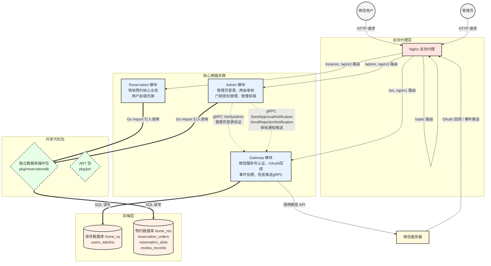

# 架构设计

## 技术栈

| 层次 | 技术选型 |
|-----|---------|
| 语言 | Go |
| HTTP 框架 | Gin |
| ORM | GORM |
| 服务间通信 | gRPC (protobuf) |
| 数据库 | MySQL 8.0 |
| 缓存 | Redis（用于微信 access_token 等缓存） |
| 反向代理 | Nginx |
| 容器化 | Docker + Docker Compose |
| 微信 SDK | silenceper/wechat/v2 |

## 模块划分

1. **Nginx 反向代理**：统一入口，路由分发，静态资源服务
2. **Gateway 模块**：微信服务号认证、OAuth 回调、消息事件处理、管理员身份验证（gRPC）、模板消息推送（gRPC）
3. **Reservation 模块**：场地预约核心业务，提交/取消/查询预约，提供用户前端页面
4. **Admin 模块**：管理员登录、两级审核（通过/驳回）、门锁密码管理、通知发送，提供管理前端页面
5. **共享包（pkg/）**：由于 Reservation 和 Admin 都需要操作预约数据库，将数据库操作独立为 `pkg/reservationdb`

## 数据库

采用**双数据库架构**：

| 数据库 | 管理方 | 表 | 说明 |
|-------|-------|---|------|
| `home_xy`（账号数据库） | Gateway | `users`, `admins` | 用户微信标识、管理员账号密码 |
| `home_res`（预约数据库） | Reservation + Admin 共享 | `reservation_orders`, `reservation_slots`, `review_records` | 预约订单、时段明细、审核记录 |

- Gateway 是**唯一**直接操作 `home_xy` 的服务
- Reservation 和 Admin 通过 `pkg/reservationdb` 共享包操作 `home_res`
- Admin 通过 gRPC 调用 Gateway 完成管理员身份验证和信息推送

## 共享包（pkg/）

| 包 | 职责 |
|---|------|
| `pkg/config/` | 通用配置结构体（Server、MySQL、Redis、JWT）+ YAML 加载器 |
| `pkg/platform/` | `InitDB()`（GORM/MySQL）和 `InitRedis()`（go-redis） |
| `pkg/reservationdb/` | 共享的 Repository 接口 + GORM 实现，操作 `home_res` 数据库 |
| `pkg/jwt/` | 用户 JWT 和管理员 JWT 的生成/解析（HMAC-SHA256，sync.Once 单例） |
| `pkg/grpc/` | gRPC 客户端连接辅助 |
| `pkg/constants/` | 共享的状态/角色常量 |

## 服务端口

| 服务 | HTTP 端口 | gRPC 端口 |
|-----|----------|----------|
| Nginx | 80 | - |
| Gateway | 8080 | 9080 |
| Reservation | 8081 | - |
| Admin | 8082 | - |

---

# 架构示意图



---

# 请求流程

## 用户预约流程

```
微信用户点击服务号菜单
    → 微信服务器构造 OAuth 链接，用户授权
    → 回调 GET /api/v1/auth/callback?code=xxx&state=xxx
    → Gateway 用 code 换 openid，签发用户 JWT
    → HTTP 302 重定向到 /reserve?token=<jwt>
    → Reservation 返回预约页面 HTML
    → 前端 js 提取 token，存入 localStorage
    → 后续 API 请求携带 Authorization: Bearer <token>
    → Reservation AuthMiddleware 验证 JWT，提取 openid
    → Handler 处理请求
```

## 管理员审核流程

```
管理员浏览器 → /admin → Admin 返回登录页面
    → 输入账号密码 POST /api/v3/auth/login
    → Admin 通过 gRPC 调用 Gateway AccountService.VerifyAdmin
    → Gateway 查询 home_xy.admins 表验证
    → Admin 签发管理员 JWT 返回给浏览器
    → 浏览器携带 Bearer token 请求 /api/v3/orders 等接口
    → Admin AdminAuthMiddleware + RoleMiddleware 验证身份和权限
    → 一级审核：POST /api/v3/review/level1/:id → 状态 5→6 或 5→7
    → 二级审核：POST /api/v3/review/level2/:id → 状态 6→1 或 6→8
    → 通过后设置密码：PUT /api/v3/review/level1/:id/slots/:slotID/password
    → 发送通知：POST /api/v3/review/level1/:id/notify
    → Admin 通过 gRPC 调用 Gateway NotificationService.SendApprovalNotification
    → Gateway 发送微信模板消息给用户
```

## 服务间通信总结

| 调用方 | 被调用方 | 方式 | 用途 |
|-------|---------|------|------|
| Admin | Gateway | gRPC | 管理员登录验证（VerifyAdmin） |
| Admin | Gateway | gRPC | 审核通过通知推送（SendApprovalNotification） |
| Admin | Gateway | gRPC | 审核驳回通知推送（SendRejectionNotification） |
| Reservation | - | 共享包 | 通过 `pkg/reservationdb` 操作预约数据库 |
| Admin | - | 共享包 | 通过 `pkg/reservationdb` 操作预约数据库 |
| Gateway | 微信服务器 | HTTPS | OAuth、用户信息、模板消息等微信 API 调用 |

# 部署架构

```
Docker Compose 编排：
    nginx (80)           — 反向代理 + 静态资源
    gateway (8080/9080)  — 微信接入 + gRPC 服务
    reservation (8081)   — 预约业务
    admin (8082)         — 审核业务
    mysql (3306)         — 数据库
    redis (6379)         — 缓存

静态资源通过 Nginx 直接提供（/static/ → /usr/share/nginx/html/static/），
设置 7 天缓存（Cache-Control: public, immutable）。
HTML 页面由各服务通过 Gin 的 LoadHTMLGlob 渲染提供。
```

# 安全设计

1. **JWT 双密钥体系**：用户 JWT 和管理员 JWT 使用不同的 secret 签名，互不信任
2. **Bearer Token**：所有 API 请求通过 `Authorization: Bearer <token>` 头传递身份
3. **角色中间件**：Admin 服务根据路由分组施加 `RoleMiddleware`，一级管理员和二级管理员权限隔离
4. **乐观锁**：审核操作使用 `WHERE status = fromStatus` 防止并发修改冲突
5. **SELECT FOR UPDATE**：预约提交时对时间范围内已有记录加行锁，防止重复预订
6. **bcrypt 密码存储**：管理员密码使用 bcrypt 哈希存储
7. **CORS 白名单**：生产环境限制允许的跨域来源域名
